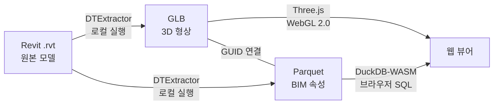
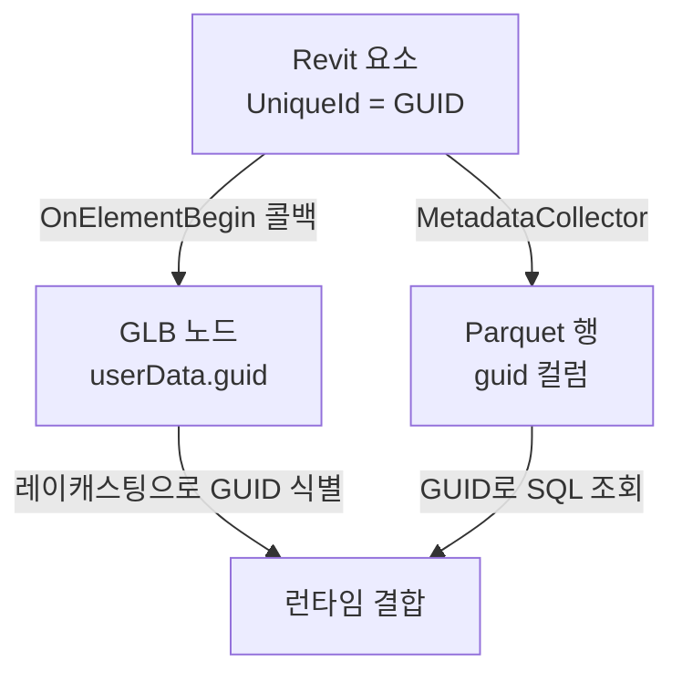
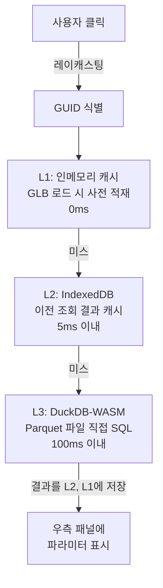

# DT Engine

Revit 모델(.rvt)에서 3D 형상과 BIM 속성을 각각 최적 포맷으로 추출한 뒤, 고유 식별자(GUID)로 연결하여 브라우저에서 렌더링과 속성 조회를 하나의 시스템으로 수행하는 디지털 트윈 엔진이다.

---

## 목차

1. [핵심 아이디어: 이중 추출과 GUID 연결](#1-핵심-아이디어-이중-추출과-guid-연결)
2. [데이터 파이프라인: Revit에서 GLB와 Parquet까지](#2-데이터-파이프라인-revit에서-glb와-parquet까지)
3. [웹 뷰어: 렌더링과 속성 조회](#3-웹-뷰어-렌더링과-속성-조회)
4. [평가](#4-평가)
5. [Demo](#5-demo)

---

## 전체 요약

이 엔진은 하나의 Revit 모델로부터 두 가지 산출물을 만들어낸다. GPU가 직접 소비하는 3D 형상 파일(GLB)과, SQL로 질의할 수 있는 컬럼 기반 속성 파일(Parquet)이다. 두 파일은 독립적인 포맷이지만, 모든 BIM 요소에 부여된 Revit UniqueId(GUID)가 양쪽에 동일하게 내장되어 있어 런타임에 결합된다. 사용자가 3D 모델에서 객체를 클릭하면 GUID를 매개로 해당 객체의 전체 Revit 파라미터가 즉시 조회되는 구조이다.

추출은 Revit 내부에서 동작하는 C# 플러그인(DTExtractor)이 담당하며, 외부 클라우드 서비스 없이 로컬에서 완결된다. 조회와 렌더링은 Three.js 기반 웹 뷰어가 담당하고, DuckDB-WASM을 통해 브라우저 내에서 Parquet 파일에 직접 SQL을 실행한다.

---

## 1. 핵심 아이디어: 이중 추출과 GUID 연결

### 왜 형상과 속성을 분리하는가

BIM 모델은 3D 형상과 수백 개의 파라미터 속성을 동시에 포함한다. 이 두 종류의 데이터는 소비 방식이 근본적으로 다르다. 형상 데이터는 GPU가 삼각형 메쉬 형태로 읽어야 하고, 속성 데이터는 조건 검색이나 통계 집계 같은 분석적 질의에 적합해야 한다. 하나의 포맷으로 양쪽을 모두 최적화하는 것은 불가능하므로, 각각의 소비자에게 맞는 포맷으로 분리 추출하는 것이 이 엔진의 출발점이다.

- **GLB (glTF Binary)**: Khronos 국제 표준 3D 포맷으로, 브라우저와 Three.js가 네이티브로 지원한다. 정점, 법선, UV, 머티리얼을 바이너리로 묶어 GPU에 직접 전달한다.
- **Apache Parquet**: 컬럼 기반 데이터 포맷으로, DuckDB-WASM이 브라우저에서 직접 SQL 질의를 수행할 수 있다. 수백 개의 파라미터 중 필요한 컬럼만 선택적으로 읽을 수 있어 전송량이 최소화된다.

### GUID가 연결하는 것

Revit의 모든 BIM 요소에는 UniqueId라는 고유 문자열이 존재한다. DTExtractor는 추출 과정에서 이 GUID를 GLB의 노드 메타데이터와 Parquet의 행 식별자 양쪽에 동일하게 기록한다. 웹 뷰어에서 사용자가 3D 객체를 클릭하면 레이캐스팅으로 해당 메쉬의 GUID를 식별하고, 이 GUID로 Parquet에서 전체 속성을 조회한다. 형상과 속성이 물리적으로 분리되어 있지만, GUID를 통해 런타임에 하나의 BIM 객체로 결합되는 것이다.

---

## 2. 데이터 파이프라인: Revit에서 GLB와 Parquet까지

### Revit 플러그인 DTExtractor

DTExtractor는 Revit 내부에서 동작하는 C# .NET 플러그인이다. Revit API가 공식 제공하는 `CustomExporter`와 `IExportContext` 인터페이스를 활용하여, Revit의 내부 렌더링 파이프라인이 생성하는 테셀레이션된 메쉬 데이터를 콜백 방식으로 수신한다. 이 메커니즘은 Revit이 화면에 그리는 것과 동일한 형상 데이터를 외부로 꺼내는 공식 경로이며, 클라우드 변환 서비스 없이 로컬 PC에서 직접 실행된다.

### 추출 과정

사용자가 Revit 리본 메뉴에서 내보내기 버튼을 누르면 다음 과정이 진행된다.

1. 활성 3D 뷰를 기반으로 CustomExporter가 모델 순회를 시작한다.
2. 각 BIM 요소에 진입할 때(`OnElementBegin`) UniqueId를 GUID로 확보하고, 동시에 해당 요소의 파라미터 수집을 시작한다.
3. 머티리얼 변경 시(`OnMaterial`) 색상, 투명도, 질감 정보를 기록한다. 50종 이상의 Revit 머티리얼 스키마를 개별적으로 매핑하여 색상을 추출한다.
4. 테셀레이션된 삼각형 메쉬가 도착하면(`OnPolymesh`) 정점, 법선, UV 좌표를 수집하고, 메쉬 해시를 계산하여 동일 형상을 감지한다. 같은 패밀리 타입(문, 창문 등)은 동일한 메쉬를 공유하므로 인스턴싱으로 처리하여 파일 크기를 줄인다.
5. 순회가 완료되면 SharpGLTF 라이브러리로 GLB 파일을, Parquet.Net 라이브러리로 Parquet 파일을 각각 직렬화한다.

### 메타데이터 추출 범위

Revit의 파라미터 체계는 단일 API 호출로 모두 접근할 수 없다. DTExtractor는 인스턴스 파라미터(`Element.Parameters`), 타입 파라미터(`Element.Symbol.Parameters`), BuiltIn 파라미터(`BuiltInParameter`), 공유 파라미터, 프로젝트 파라미터, 글로벌 파라미터, 패밀리 파라미터의 7종을 개별적으로 순회하여 하나의 Parquet 레코드에 통합한다. 수치 값은 Revit 내부 단위(피트, 라디안)를 원본 그대로 보존하여 변환 과정의 정밀도 손실을 방지한다.

### 산출물

하나의 Revit 모델에서 두 파일이 동시에 생성된다.

| 산출물    | 포맷                  | 역할                                   | GUID 저장 위치          |
| --------- | --------------------- | -------------------------------------- | ----------------------- |
| 형상 파일 | GLB (glTF 2.0 Binary) | GPU 렌더링용 메쉬, 머티리얼, 노드 계층 | 노드의 `userData.guid`  |
| 속성 파일 | Apache Parquet        | 전체 BIM 파라미터, SQL 질의 대상       | `guid` 컬럼 (행 식별자) |

실제 테스트에서 racbasic 모델은 GLB 8MB + Parquet 147KB, snowdon 모델은 GLB 64MB + Parquet 934KB, factorial 모델은 GLB 166MB + Parquet 1.1MB로 추출되었다.

---

## 3. 웹 뷰어: 렌더링과 속성 조회

### 렌더링 엔진

웹 뷰어는 Three.js 기반의 WebGL 2.0 렌더러로 구현되어 있다. 렌더링 백엔드는 추상화 인터페이스(`IRenderBackend`)로 분리되어 있으며, WebGPU 가용 여부를 런타임에 감지하는 구조가 갖추어져 있다. 현재는 WebGL 2.0 백엔드가 동작하고, WebGPU 백엔드는 Three.js의 WebGPURenderer가 성숙하면 전환할 수 있도록 설계되어 있다.

렌더링 기능으로는 PBR 머티리얼, 실시간 그림자(PCFSoftShadowMap), 후처리 효과(SSAO, Bloom, Outline), 톤 매핑(ACES Filmic) 등이 구현되어 있으며, Material, Wireframe, X-Ray 세 가지 렌더링 모드를 지원한다. 카메라는 Perspective와 Orthographic 간 전환이 가능하고, 모델별로 사전 정의된 카메라 프리셋으로 자동 애니메이션된다.

### Click-to-Data: 4단 캐시 시스템

이 엔진의 핵심 인터랙션은 사용자가 3D 객체를 클릭했을 때 해당 요소의 전체 Revit 파라미터가 표시되는 루프이다. 클릭 좌표에서 레이캐스팅으로 메쉬를 식별하고, 메쉬-GUID 매핑 테이블에서 GUID를 찾은 뒤, 4단 캐시 계층을 순차적으로 조회한다.

- **L1 (인메모리)**: GLB 로드 시 노드의 GUID와 카테고리 정보를 Map에 사전 적재한다. 즉시 접근 가능하지만 데이터가 제한적이다.
- **L2 (IndexedDB)**: 이전에 L3에서 조회한 전체 메타데이터를 브라우저 로컬 스토리지에 캐시한다. 동일 객체 재클릭 시 Parquet 재질의 없이 응답한다.
- **L3 (DuckDB-WASM)**: 브라우저 내 WebAssembly로 동작하는 DuckDB 엔진이 Parquet 파일에 직접 SQL을 실행한다. GUID 조건으로 단일 행을 조회하며, 결과를 L2와 L1에 역캐싱한다.
- **L4 (서버 API)**: PostgreSQL 서버를 통한 교차 모델 참조나 변경 이력 조회를 위한 계층으로, 현재 인터페이스만 정의되어 있다.

대부분의 속성 조회는 L1~L3 계층 내에서 서버 통신 없이 100ms 이내에 완료된다.

### DuckDB-WASM의 역할

DuckDB-WASM은 이 엔진에서 속성 질의 엔진으로 기능한다. 웹 뷰어가 초기화될 때 Web Worker에서 DuckDB 인스턴스를 생성하고, Parquet 파일의 URL을 등록한다. 이후 GUID 기반 단일 행 조회뿐 아니라 카테고리별 필터링이나 통계 집계 같은 분석적 SQL도 브라우저 내에서 실행할 수 있다. Parquet의 컬럼 기반 구조와 DuckDB의 벡터화 실행 엔진이 결합되어, 서버 없이도 수천 개의 BIM 요소에 대한 질의가 가능하다.

---

## 4. 평가

### 강점

**포맷 분리의 실효성.** 형상과 속성을 각각 GPU와 SQL 엔진에 최적화된 포맷으로 분리한 것은 실질적인 성능 이점을 가져온다. GLB는 Three.js가 추가 변환 없이 직접 소비하고, Parquet는 DuckDB-WASM이 컬럼 단위로 부분 읽기할 수 있어 전송량과 처리 속도 모두에서 유리하다.

**GUID 연결의 단순함.** 형상과 속성을 연결하는 메커니즘이 Revit UniqueId라는 이미 존재하는 식별자 하나에 의존한다. 별도의 매핑 테이블이나 인덱스 서버 없이, 추출 시점에 양쪽 파일에 동일한 값을 기록하는 것만으로 런타임 결합이 성립한다.

**클라우드 비의존.** 추출 과정이 Revit 로컬 플러그인으로 완결되고, 속성 조회도 브라우저 내 DuckDB-WASM으로 처리되므로 외부 클라우드 서비스나 API 호출 비용이 발생하지 않는다. 네트워크가 불안정한 환경에서도 캐시된 데이터로 동작할 수 있다.

### 한계

**전체 로딩 방식.** 현재 GLB 파일을 한 번에 전부 로드한다. 소규모 모델(8MB)에서는 문제가 없지만, 대형 모델(166MB)에서는 초기 로딩 시간이 길어진다. LOD(Level of Detail) 기반 점진적 로딩이나 공간 분할 스트리밍은 아직 구현되지 않았다.

**WebGPU 미활성.** 렌더링 백엔드 추상화와 WebGPU 감지 로직은 갖추어져 있으나, 실제 WebGPU 렌더링 경로는 구현되지 않았다. Compute Shader 기반 GPU 컬링이나 Multi-Draw Indirect 같은 대규모 모델 최적화는 WebGPU 전환 이후에 가능하다.

**서버 계층 부재.** 4단 캐시의 L4(PostgreSQL) 계층이 인터페이스만 정의되어 있어, 교차 모델 참조나 변경 이력 추적 같은 서버 의존 기능은 사용할 수 없다. 다수의 모델을 통합 관리하는 시나리오에서는 서버 측 저장소가 필요하다.

### 개선 방향

- **점진적 로딩**: GLB를 공간 기반으로 분할하고, 뷰포트에 보이는 영역부터 우선 로드하는 스트리밍 방식을 도입하면 대형 모델의 초기 체감 속도가 개선된다.
- **WebGPU 백엔드**: Three.js WebGPURenderer의 안정화에 맞춰 실제 WebGPU 렌더링 경로를 구현하면, GPU 컬링과 드로우콜 병합을 통해 수십만 개 객체의 렌더링 성능이 향상된다.
- **서버 인프라**: PostgreSQL 기반 L4 캐시와 모델 버전 관리를 구축하면, 복수 모델 통합 조회와 시간에 따른 변경 추적이 가능해진다.
- **인스턴싱 강화**: 현재 메쉬 해시 기반 중복 감지가 구현되어 있으나, glTF의 `EXT_mesh_gpu_instancing` 확장을 적극 활용하면 파일 크기와 드로우콜을 추가로 줄일 수 있다.

---

## 5. Demo

### Image

### Video

https://github.com/user-attachments/assets/ad315873-fe85-4c3a-80e3-8fc57bb970f7
