# Idea-01

**Autodesk Tandem/LMV 생태계 종속 제거를 위한 프로덕션급 엔진 설계**

---

## 목차

1. [Executive Summary](#1-executive-summary)
2. [문제 정의: Autodesk 종속의 기술적, 재정적 위험](#2-문제-정의-autodesk-종속의-기술적-재정적-위험)
3. [제안 아키텍처: 세 가지 전략 축](#3-제안-아키텍처-세-가지-전략-축)
4. [기술 구현: Revit C# 플러그인 (DTExtractor)](#4-기술-구현-revit-c-플러그인-dtextractor)
5. [데이터 인프라: 저장소 설계와 4단 캐시 시스템](#5-데이터-인프라-저장소-설계와-4단-캐시-시스템)
6. [시각화 코어: Three.js 기반 하이브리드 렌더링](#6-시각화-코어-threejs-기반-하이브리드-렌더링)
7. [사업적 영향: 운영 독립성, TCO 분석, 확장성](#7-사업적-영향-운영-독립성-tco-분석-확장성)
8. [결론: 자체 기술 자산으로의 전환](#8-결론-자체-기술-자산으로의-전환)

---

## 1. Executive Summary

본 문서는 Autodesk Tandem(LMV SDK) 및 APS(Autodesk Platform Services)에 대한 기술적, 재정적 종속을 완전히 제거하고, 자체 운영이 가능한 프로덕션급 BIM 디지털 트윈 엔진의 설계 청사진을 제시한다.

이 청사진은 단순한 기술 대체가 아닌 **운영 주권(Operational Sovereignty)** 확보를 위한 전략적 의사결정 문서이다.

**세 가지 전략 축:**

| 전략 축                                  | 핵심 목표                                                         | 기대 효과                                   |
| ---------------------------------------- | ----------------------------------------------------------------- | ------------------------------------------- |
| **Zero-Autodesk 데이터 파이프라인**      | APS 클라우드 완전 제거, 자체 C# .NET Revit 플러그인으로 로컬 추출 | 연간 $19,040+ 고정비 제거, 데이터 주권 확보 |
| **이중 렌더링 엔진 (Dual-Engine)**       | WebGPU 기본 + WebGL 2.0 완전 폴백                                 | 최신 환경 극한 성능 + 구형 환경 100% 안정성 |
| **모듈형 컴포넌트 시스템 (Core-Plugin)** | ECS 기반 데이터 아키텍처, 기능별 독립 모듈화                      | 무제한 기능 확장, 장기 유지보수성 확보      |

**핵심 산출물:**

- **데이터 추출**: `.rvt` → `.glb`(glTF 2.0) + `.parquet`(Apache Parquet). 국제 표준 개방 포맷.
- **렌더링**: Rendering Abstraction Layer(RAL) 아래 WebGPU/WebGL 2.0 이중 백엔드.
- **속성 조회**: GUID 기반 4단 캐시(L1~L3 클라이언트 완결, 100ms 이내). DuckDB-WASM 브라우저 측 SQL 분석.
- **확장성**: ECS + Core-Plugin 아키텍처로 도메인 기능을 독립 모듈로 배포/교체.

---

## 2. 문제 정의: Autodesk 종속의 기술적, 재정적 위험

### 2.1. 현행 Tandem/LMV 아키텍처

Autodesk Tandem은 LMV(Large Model Viewer) SDK를 기반으로 구축되어 있다. 코드베이스 분석 결과, 핵심 구조는 다음과 같다.

- **DtApp**: 최상위 애플리케이션 객체. WebSocket 기반 실시간 통신(`DtMsgWs`), Web Worker 기반 비동기 속성 처리(모바일 2개, 데스크톱 4개).
- **DtFacility**: 건물/시설 단위. 복수 `DtModel` 관리, Priority 기반 로드 큐(Primary/Visible/Hidden).
- **DtModel**: 개별 3D 모델. OTG(Optimized Tandem Geometry) 독점 포맷. Fragment 기반 렌더링, dbId 매핑.
- **Viewer3D**: Three.js 커스텀 포크 기반 WebGL 렌더러. MRT(다중 렌더 타겟)로 ID/깊이/하이라이트 처리.

### 2.2. 구조적 종속 지점

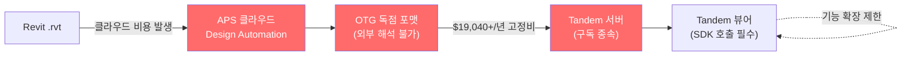

| 종속 지점                 | 상세                                                         | 사업적 위험                           |
| ------------------------- | ------------------------------------------------------------ | ------------------------------------- |
| **OTG 독점 포맷**         | 외부 생성/조작 불가. 모든 데이터 로드가 Autodesk 서버에 종속 | 서비스 중단 시 전체 시스템 마비       |
| **APS Design Automation** | Revit → OTG 변환이 Autodesk 클라우드에서만 수행 가능         | 변환 비용의 지속적 발생               |
| **WebSocket 서버 종속**   | 속성 변이(Mutation)가 Tandem 서버 왕복 필수                  | 오프라인/로컬 우선 아키텍처 구현 불가 |
| **라이선스 종속**         | Tandem SDK 사용 자체가 Autodesk 구독에 종속                  | 가격 변동에 대한 협상력 부재          |

### 2.3. 종속 비용 분석 (연간)

2026년 1월 7일부로 적용되는 Autodesk 라이선스 정책 변경을 반영한 비용 분석이다.

| 비용 항목               | 단가                                      | 연간 비용 (추정)     |
| ----------------------- | ----------------------------------------- | -------------------- |
| **Tandem 구독**         | $3,540/년 (에셋 10,000개, 스트림 2,000개) | $3,540               |
| **Tandem Connect**      | $10,335/년 (프로덕션 플러그인 10개)       | $10,335              |
| **Tandem MQTT 애드온**  | $5,165/년/브로커                          | $5,165               |
| **APS 클라우드 크레딧** | Revit DA: 6 CC/시간 (~$0.10/분)           | 사용량 비례          |
| **APS 모델 변환**       | Model Derivative API: CC 소비             | 사용량 비례          |
| **2026 라이선스 변경**  | 다중 사용자 할인 제거, 갱신 할인 제거     | 추가 인상 예상       |
| **합계 (고정비만)**     |                                           | **최소 $19,040+/년** |

DA4R의 경우 400MB 모델 1건 변환에 약 4분이 소요되며, 이는 약 $0.40/건에 해당한다. 월 100건 변환 시 연간 $480이 추가된다. 이 비용 구조는 규모 확대 시 선형적으로 증가하며, Autodesk의 일방적 가격 인상(2026년 정책 변경 사례)에 무방비로 노출된다.

---

## 3. 제안 아키텍처: 세 가지 전략 축

### 3.1. 전환 후 데이터 흐름

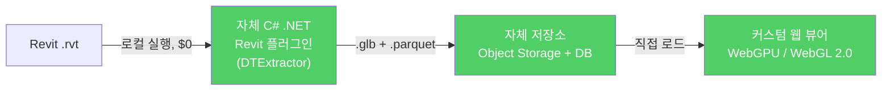

전 구간이 자체 운영 인프라로 구성되며, 외부 클라우드 서비스 호출이 존재하지 않는다.

### 3.2. 3단계 파이프라인 구조

엔진의 전체 데이터 흐름은 세 단계로 구성된다.

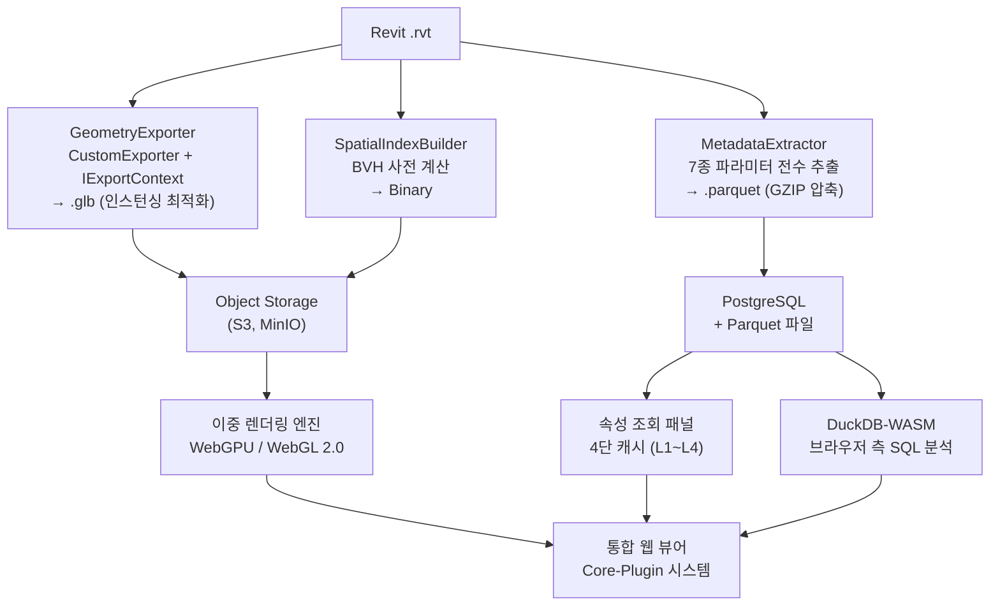

### 3.3. 핵심 설계 결정

| 설계 영역          | 선택                          | 선택 근거                                         |
| ------------------ | ----------------------------- | ------------------------------------------------- |
| **데이터 추출**    | 자체 C# Revit 플러그인 (로컬) | APS 클라우드 비용 영구 제거, 네트워크 지연 제거   |
| **형상 포맷**      | glTF 2.0 (GLB)                | Khronos 국제 표준, WebGPU/Three.js 네이티브 지원  |
| **속성 포맷**      | Apache Parquet                | 컬럼 기반 분석 최적화, DuckDB-WASM 직접 쿼리 가능 |
| **렌더링 엔진**    | WebGPU 우선 + WebGL 2.0 폴백  | 차세대 성능 확보 + 100% 브라우저 호환성           |
| **속성 저장소**    | PostgreSQL + DuckDB-WASM      | OLTP 포인트 조회 + OLAP 분석적 스캔 이중 최적화   |
| **데이터 연결 키** | Revit UniqueId (GUID)         | 모든 데이터 계층을 관통하는 유일한 식별자         |
| **엔진 아키텍처**  | ECS + Core-Plugin             | 기능 간 결합도 제거, 독립 배포/확장 가능          |

---

## 4. 기술 구현: Revit C# 플러그인 (DTExtractor)

### 4.1. 설계 원칙

APS(Forge) Design Automation for Revit(DA4R)을 완전히 제거하고, 자체 C# .NET Revit 플러그인 **DTExtractor**를 통해 로컬 환경에서 직접 형상과 메타데이터를 추출한다.

1. Autodesk 클라우드 크레딧 비용을 영구적으로 제거한다.
2. 데이터 변환의 속도와 품질을 자체적으로 제어한다.
3. 네트워크 지연 없이 즉시 변환 결과를 확보한다.
4. 민감한 설계 데이터가 외부 클라우드로 전송되지 않도록 보장한다.

### 4.2. 이중 추출 전략: GLB(형상)와 Parquet(메타데이터)의 분리

DTExtractor는 하나의 `.rvt` 파일로부터 두 종류의 독립적인 출력을 동시에 생성한다. 이 이중 추출(Dual-Export) 전략이 본 엔진 아키텍처의 근간이다.

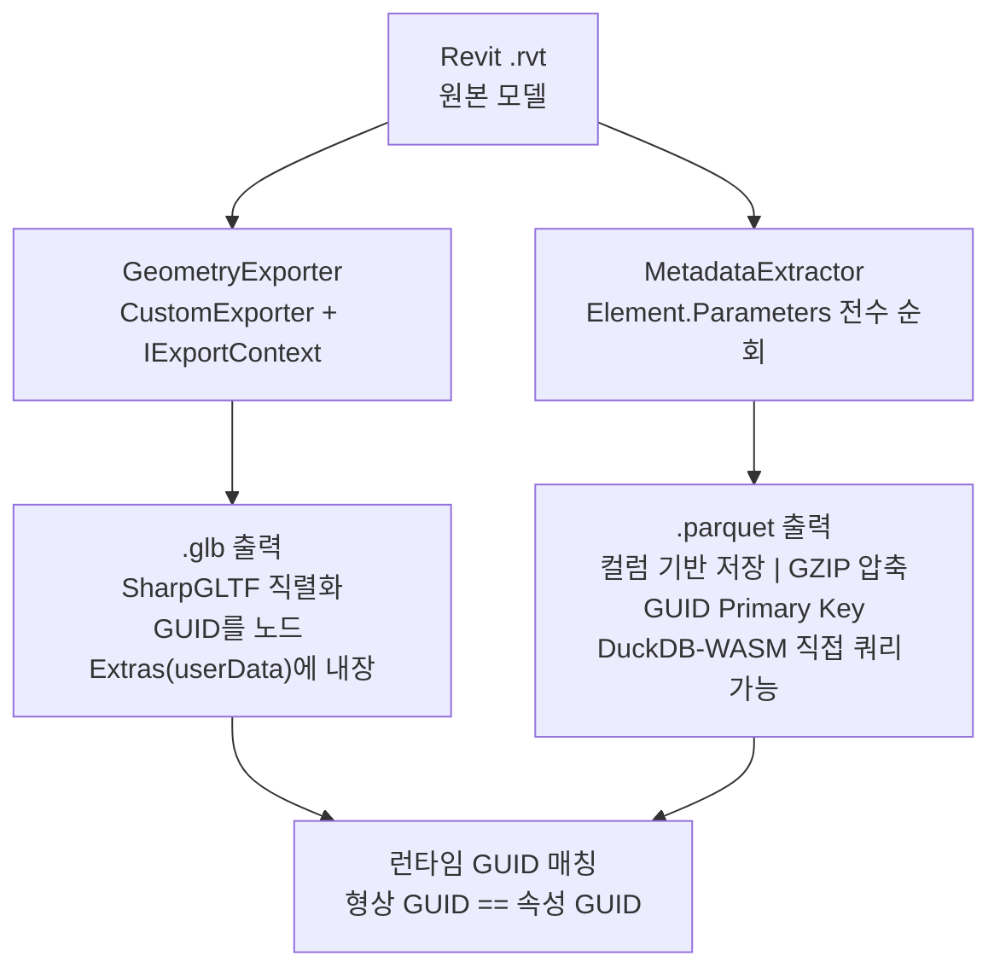

**분리하는 이유:**

- **GLB**: GPU가 직접 소비하는 바이너리 형상 데이터이다. WebGPU/WebGL 파이프라인에 최적화된 형태로, 렌더링 성능이 최우선이다.
- **Parquet**: SQL 기반 분석적 쿼리에 최적화된 컬럼 기반 데이터이다. DuckDB-WASM이 브라우저에서 직접 쿼리하며, HTTP Range 요청으로 필요한 부분만 부분 로드가 가능하다.
- **GUID**: 양쪽 파일 모두에 Revit `UniqueId`가 체계적으로 내장되어, 런타임에 형상과 속성을 결합하는 유일한 식별자 역할을 한다.

### 4.3. IExportContext: 클라우드 변환을 우회하는 핵심 메커니즘

Revit API는 `CustomExporter` 클래스와 `IExportContext` 인터페이스를 공식 제공한다. 이 조합은 Revit의 내부 렌더링 파이프라인에 직접 접근하여, 화면에 표시되는 것과 동일한 테셀레이션된 메쉬 데이터를 **콜백 방식으로 수신**한다. APS Design Automation이 클라우드 서버에서 수행하는 작업을, 이 API를 활용하면 **로컬 PC의 Revit 프로세스 내에서 직접 실행**할 수 있다.

**콜백 흐름:**

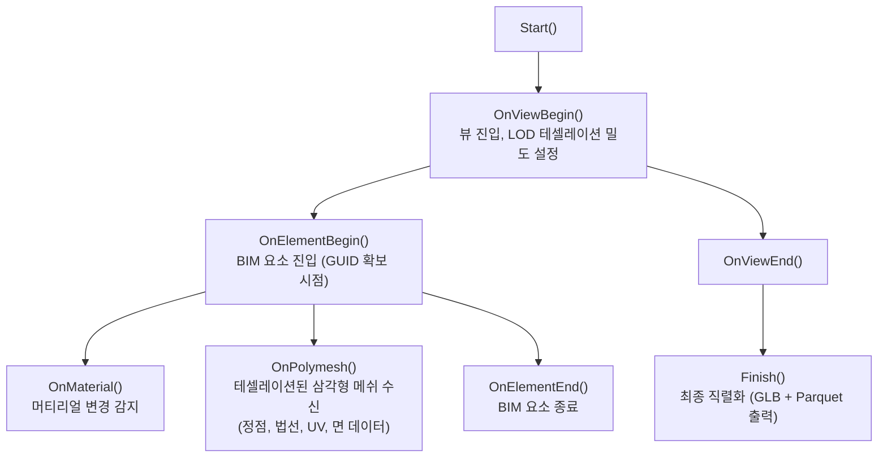

### 4.4. 형상 추출 핵심 동작

DTExtractor의 `DTGeometryExporter`는 `IExportContext`를 구현하며, 다음의 핵심 동작을 수행한다.

- **GUID 확보 시점**: `OnElementBegin()`에서 현재 요소의 `UniqueId`를 즉시 확보한다. 이 GUID가 이후 모든 데이터 계층을 관통하는 유일한 연결 키가 된다.
- **형상과 속성의 동시 추출**: `OnElementBegin()`에서 `MetadataCollector`를 호출하여, 형상 콜백과 동시에 속성 추출이 진행된다. 하나의 모델 순회로 양쪽 출력이 모두 생성된다.
- **머티리얼 추출**: `OnMaterial()`에서 50종 이상의 Revit 머티리얼 스키마(Prism, Classic 등)를 개별 매핑하여 색상, 투명도, 질감 정보를 추출한다. 폴백 체인을 통해 누락 없이 색상을 확보한다.
- **메쉬 해시 기반 중복 감지**: `OnPolymesh()`에서 수신되는 정점/면 데이터의 해시를 계산하여 동일 형상을 감지한다. Revit 모델에서 동일한 패밀리 타입(문, 창문, 기둥)은 동일한 메쉬를 공유하므로, 중복 메쉬를 재사용하여 파일 크기를 절감한다.
- **GLB 직렬화**: 순회 완료 후 SharpGLTF 라이브러리를 통해 GLB 파일을 생성한다. 각 노드의 `Extras`에 GUID와 이름을 JSON으로 내장하여, 웹 뷰어에서 `userData.guid`로 접근할 수 있게 한다.

### 4.5. 메타데이터 추출: 7종 파라미터 전수 수집

Revit 속성 데이터의 무손실 추출이 이 엔진의 핵심 차별점이다. Revit의 파라미터 체계는 7종으로 분류되며, 단일 API 호출로는 모든 데이터를 확보할 수 없다.

| 파라미터 유형    | 접근 경로                                     | 특성                             |
| ---------------- | --------------------------------------------- | -------------------------------- |
| **인스턴스**     | `Element.Parameters`                          | 개별 인스턴스 고유 값            |
| **타입**         | `Element.Symbol.Parameters` (FamilyInstance)  | 패밀리 타입 공유 값              |
| **공유(Shared)** | `Parameter.IsShared`, `Parameter.GUID`        | 프로젝트 간 공유, 고유 GUID 보유 |
| **프로젝트**     | `ParameterFilterElement` 쿼리                 | 프로젝트 수준 정의               |
| **글로벌**       | `GlobalParametersManager` (Revit 2017+)       | 프로젝트 전역 상수               |
| **BuiltIn**      | `Element.get_Parameter(BuiltInParameter)`     | Revit 내장 시스템 파라미터       |
| **패밀리**       | `FamilyManager.Parameters` (패밀리 편집기 내) | 패밀리 정의 시점 파라미터        |

`DTMetadataCollector`는 이 7종 파라미터를 개별 순회하여 하나의 Parquet 레코드에 통합한다. 추출된 데이터는 Parquet.Net 라이브러리를 통해 20개 컬럼의 GZIP 압축 Parquet 파일로 직렬화되며, 파라미터 값은 JSON 문자열로 직렬화하여 저장한다.

**데이터 무결성 보장:**

- **내부 단위 보존**: Revit 내부 단위(길이: 피트, 각도: 라디안)를 변환 없이 원본 그대로 저장한다. 단위 변환 과정의 정밀도 손실을 원천 차단한다.
- **ElementId 참조 해결**: `StorageType.ElementId`인 파라미터는 해당 요소의 `UniqueId`로 변환하여 저장함으로써, 모델 외부에서도 참조 관계를 보존한다.
- **공유 파라미터 GUID**: `Parameter.IsShared`가 true인 경우 `Parameter.GUID`를 별도 저장하여, 프로젝트 간 동일 파라미터의 식별이 가능하도록 한다.

### 4.6. GUID 내장 전략

GUID가 GLB와 Parquet 양쪽에 어떻게 내장되는지가 전체 아키텍처의 핵심이다.

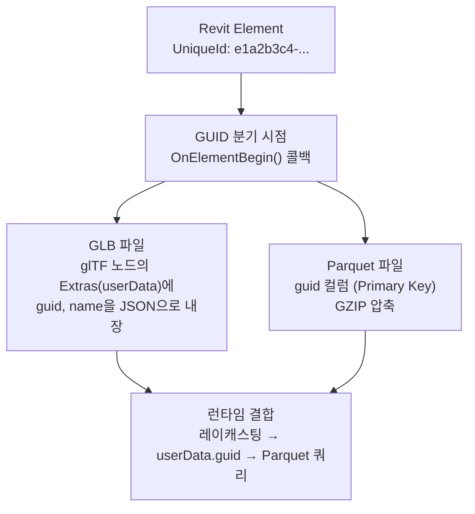

웹 뷰어에서 GLB를 로드하면 각 노드의 `userData.guid`에서 GUID를 읽어 메쉬-GUID 매핑 테이블을 구성한다. 사용자 클릭 시 레이캐스팅으로 메쉬를 식별하고, 이 매핑 테이블에서 GUID를 조회한 뒤 Parquet에서 전체 속성을 가져온다.

### 4.7. 출력 포맷 상세

**형상 출력 -- glTF 2.0 (GLB):**

DTExtractor는 SharpGLTF 라이브러리를 사용하여 표준 glTF 2.0 Binary(GLB) 파일을 생성한다. 각 BIM 요소는 glTF 노드로 매핑되며, 노드의 `Extras` 필드에 GUID와 이름이 JSON으로 내장된다. 머티리얼은 PBR Metallic-Roughness 모델로 변환되고, 투명도가 있는 요소는 BLEND 알파 모드를 사용한다. 모든 머티리얼은 양면(DoubleSided) 렌더링으로 설정된다.

**속성 출력 -- Apache Parquet:**

1. **컬럼 기반 저장**: BIM 속성의 분석적 쿼리(예: "내화등급 2시간 이상인 벽체")에 최적화된 구조
2. **DuckDB-WASM 직접 쿼리**: 브라우저에서 서버 없이 직접 SQL 쿼리 가능
3. **HTTP Range 요청**: 전체 파일 다운로드 없이 필요한 행 그룹/컬럼만 부분 로드
4. **GZIP 압축**: JSON 대비 대폭 용량 절감
5. **20개 컬럼 스키마**: GUID, ElementId, Category, FamilyName, TypeName, Level, Phase, BoundingBox(6축), 파라미터(JSON 문자열) 등

### 4.8. 플러그인 배포 및 배치 자동화

| 항목          | 설계                                                                |
| ------------- | ------------------------------------------------------------------- |
| **배포 방식** | Revit Add-In Manager 호환 `.addin` 매니페스트 + MSI/MSIX 인스톨러   |
| **버전 호환** | Revit 2023~2024 지원. 조건부 컴파일로 연도별 API 차이에 대응        |
| **실행 모드** | 대화형(GUI 리본 버튼) + 배치 모드(CLI 인수를 통한 자동 실행)        |
| **배치 처리** | Revit Batch Processor 또는 자체 CLI 래퍼를 통한 복수 모델 순차 처리 |

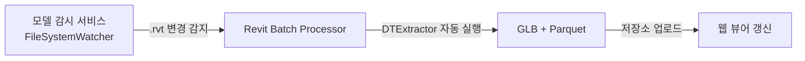

---

## 5. 데이터 인프라: 저장소 설계와 4단 캐시 시스템

### 5.1. 저장소 구성

| 데이터 유형            | 저장소                        | 접근 패턴                              |
| ---------------------- | ----------------------------- | -------------------------------------- |
| 3D 형상 (.glb) + BVH   | Object Storage (S3, MinIO 등) | HTTP Range 요청 기반 스트리밍 로드     |
| 속성 데이터 (.parquet) | PostgreSQL + Parquet 파일     | 포인트 조회(DB) + 분석적 스캔(Parquet) |
| 실시간 IoT 스트림      | TimescaleDB + WebSocket       | 시계열 저장 + 실시간 양방향 전송       |

### 5.2. 이중 속성 저장소: PostgreSQL + DuckDB-WASM

단일 데이터베이스로는 BIM 속성 데이터의 상반된 두 가지 접근 패턴을 최적으로 처리할 수 없다.

| 접근 패턴              | 특성                                   | 최적 엔진                                |
| ---------------------- | -------------------------------------- | ---------------------------------------- |
| **포인트 조회 (OLTP)** | 특정 GUID의 전체 속성 로드             | PostgreSQL (JSONB, B-tree 인덱스)        |
| **분석적 스캔 (OLAP)** | "내화등급 2시간 이상인 벽체 전부 조회" | DuckDB-WASM (컬럼 스토리지, 벡터화 실행) |

### 5.3. PostgreSQL 스키마

서버 측 속성 저장소는 PostgreSQL 기반으로 설계한다. 핵심 테이블은 다음과 같다.

- **elements**: GUID를 PK로 하는 기본 요소 테이블. ElementId, Category, FamilyName, TypeName, Level, Phase, 모델 버전 등을 저장한다.
- **instance_parameters**: 요소별 인스턴스 파라미터를 JSONB로 저장한다. GUID로 elements 테이블을 참조한다.
- **type_parameters**: 타입 키별 파라미터를 JSONB로 저장한다. 동일 타입의 요소들이 공유하므로 중복 저장을 방지한다.
- **shared_parameter_definitions**: 공유 파라미터의 정의(GUID, 이름, 데이터 타입, 단위)를 관리한다.
- **model_versions**: 모델별 추출 이력과 메타정보를 관리한다.

Category, Level에 B-tree 인덱스를, instance_parameters의 JSONB에 GIN 인덱스를 적용하여 다양한 조회 패턴을 최적화한다.

### 5.4. DuckDB-WASM 브라우저 측 분석

DuckDB-WASM은 WebAssembly로 컴파일된 DuckDB 엔진이다. 서버에 쿼리를 전송하는 대신, 클라이언트가 Parquet 파일을 HTTP Range 요청으로 부분 로드하여 브라우저 내에서 직접 SQL을 실행한다. Web Worker에서 DuckDB 인스턴스를 생성하고, `read_parquet()` 함수로 Parquet 파일에 직접 SQL 쿼리를 수행한다.

| DuckDB-WASM 특성       | 효과                                                            |
| ---------------------- | --------------------------------------------------------------- |
| **HTTP Range 요청**    | Parquet 파일 전체 다운로드 없이 필요한 행 그룹/컬럼만 부분 로드 |
| **Predicate Pushdown** | Parquet 메타데이터 기반으로 조건 불일치 행 그룹을 사전 필터링   |
| **Column Pruning**     | 수백 개 파라미터 중 쿼리에 필요한 컬럼만 선택적 전송            |
| **서버 비용 절감**     | 분석적 쿼리를 클라이언트로 오프로드하여 서버 API 호출 최소화    |
| **오프라인 지원**      | 캐시된 Parquet 파일에 대해 네트워크 없이 쿼리 실행 가능         |
| **Arrow 호환**         | 쿼리 결과가 Arrow 포맷으로 반환, GPU/Worker로 제로카피 전달     |

### 5.5. GUID 기반 데이터 연합 아키텍처

Revit `UniqueId`(GUID)를 모든 데이터 레이어를 관통하는 유일한 연결 키로 사용한다. 각 레이어는 독립적으로 업데이트되며, GUID를 통해 런타임에 결합된다.

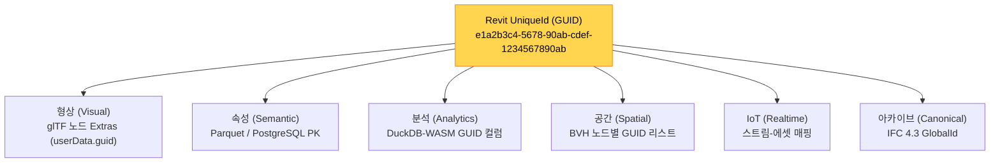

| 데이터 레이어             | 포맷                    | GUID 저장 위치                       | 갱신 빈도         |
| ------------------------- | ----------------------- | ------------------------------------ | ----------------- |
| 형상 (Visual)             | glTF/GLB                | 노드 `Extras` (`userData.guid`)      | 모델 변경 시      |
| 핵심 속성 (Inline)        | GLB 내장                | 노드 `Extras` (`userData.guid/name`) | 모델 변경 시      |
| 전체 속성 (Semantic)      | Parquet / PostgreSQL    | Primary Key                          | 모델 변경 시      |
| 분석 캐시 (Analytics)     | DuckDB-WASM / Parquet   | GUID 컬럼                            | 쿼리 시 on-demand |
| 공간 인덱스 (Spatial)     | 바이너리 BVH            | 노드별 GUID 리스트                   | 모델 변경 시      |
| IoT 스트림 (Realtime)     | WebSocket / TimescaleDB | 스트림-에셋 매핑 테이블              | 실시간            |
| 원본 아카이브 (Canonical) | IFC 4.3                 | GlobalId                             | 모델 변경 시      |

### 5.6. "Click-to-Data" 루프: 4단 캐시 시스템

사용자가 3D 모델에서 객체를 클릭했을 때, GUID를 매개로 형상과 정보가 결합되는 전체 흐름이다. 이것이 디지털 트윈 엔진의 핵심 인터랙션 루프이다.

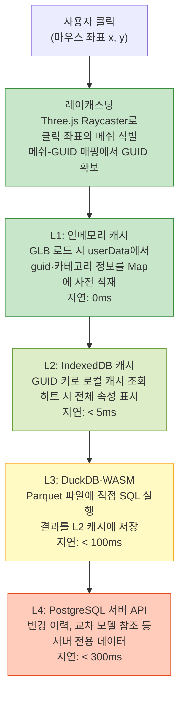

| 계층   | 데이터 소스                                    | 지연 시간 | 대상 데이터                                   |
| ------ | ---------------------------------------------- | --------- | --------------------------------------------- |
| **L1** | 인메모리 Map (GLB 로드 시 `userData`에서 적재) | 0ms       | GUID, 이름, 카테고리                          |
| **L2** | IndexedDB (브라우저 로컬)                      | < 5ms     | 최근 조회 객체의 전체 속성 (캐시 히트 시)     |
| **L3** | DuckDB-WASM (Parquet 직접 쿼리)                | < 100ms   | 전체 속성, 서버 경유 없이 클라이언트 처리     |
| **L4** | PostgreSQL (서버 API)                          | < 300ms   | 변경 이력, 교차 모델 참조 등 서버 전용 데이터 |

대부분의 속성 조회는 L1~L3 계층 내에서 **100ms 이내에 완료**된다. Tandem 구조에서 모든 속성 조회가 Autodesk 서버 왕복을 필요로 했던 것과 대비되는 근본적 개선이다.

---

## 6. 시각화 코어: Three.js 기반 하이브리드 렌더링

### 6.1. 이중 렌더링 엔진 설계 원칙

디지털 트윈 서비스는 모든 사용자에게 안정적으로 동작해야 한다. 최신 워크스테이션의 엔지니어부터 현장 태블릿의 시설 관리자까지, 하드웨어 스펙에 관계없이 시각적, 데이터적 일관성을 보장해야 한다.

이를 위해 **Rendering Abstraction Layer(RAL)** 아래에 두 개의 독립적인 렌더링 백엔드를 구현한다.

- **자동 감지**: 런타임 시 `navigator.gpu` 존재 여부와 어댑터 요청 결과로 WebGPU 사용 가능성을 판단한다.
- **기능 동등성**: WebGL 2.0 경로는 기능이 축소된 폴백이 아니라, WebGL 2.0의 최대 역량을 활용한 독자적 렌더링 경로이다.
- **시각적 일관성**: 양 백엔드의 렌더 결과를 자동 비교(PSNR 40dB 이상)하여 차이를 검증한다.

### 6.2. Three.js 기반 런타임 엔진 선택

Three.js r160+의 `WebGPURenderer`는 WebGPU와 WebGL 2.0 이중 백엔드를 이미 구현하고 있다. 생성자에서 `forceWebGL: boolean` 옵션으로 WebGL 2.0 강제 사용이 가능하며, 기본값은 WebGPU 우선 시도 후 자동 폴백이다. 이 설계를 참조하되, BIM 특화 최적화(ID 렌더링, 인스턴싱, LOD 스트리밍)를 자체 구현한다.

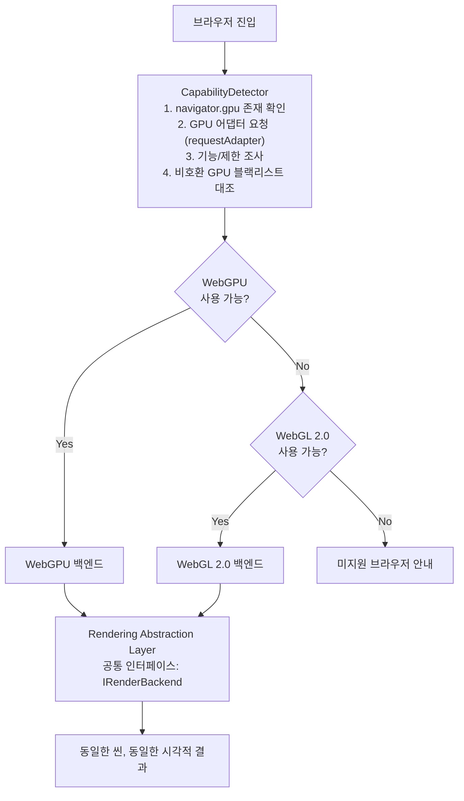

### 6.3. RAL 핵심 인터페이스

RAL(Rendering Abstraction Layer)은 `IRenderBackend` 인터페이스를 통해 WebGPU/WebGL 2.0 백엔드를 추상화한다. 이 인터페이스는 버퍼/텍스처 생성, 렌더 파이프라인 구성, 렌더 패스 실행, 인스턴싱 렌더, 픽셀 ID 읽기 등의 공통 메서드를 정의하며, 각 백엔드가 자체 방식으로 구현한다. `BackendCapabilities` 구조체를 통해 Compute Shader, Indirect Draw, Multi-Draw 등의 지원 여부를 런타임에 조회할 수 있다.

### 6.4. WebGPU 백엔드: 고성능 렌더링 파이프라인

WebGPU가 사용 가능한 환경에서 활성화되는 최적 렌더링 경로이다. Compute Shader를 활용한 GPU 측 컬링과 Multi-Draw Indirect를 통한 draw call 극소화가 핵심이다.

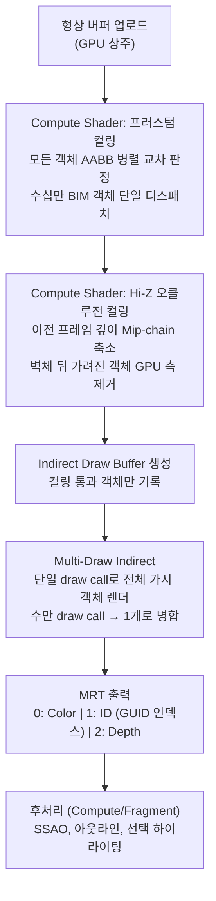

### 6.5. WebGL 2.0 백엔드: 범용 안정 경로

WebGPU를 사용할 수 없는 환경에서 동일한 시각적 결과를 보장한다. 기능 축소가 아니라, WebGL 2.0의 최대 역량을 활용하는 독자적 최적화 렌더러이다.

| 처리 단계            | WebGPU 백엔드        | WebGL 2.0 백엔드                         |
| -------------------- | -------------------- | ---------------------------------------- |
| **비가시 객체 제거** | GPU Compute Shader   | CPU 기반 BVH 탐색 (Web Worker 병렬)      |
| **Draw Call 최적화** | Multi-Draw Indirect  | `WEBGL_multi_draw` 확장 + BatchedMesh    |
| **인스턴싱**         | GPU 인스턴싱         | `drawElementsInstanced` (WebGL 2.0 내장) |
| **ID 렌더링**        | MRT + Storage Buffer | MRT (`drawBuffers`) + Float 텍스처       |
| **셰이더 언어**      | WGSL                 | GLSL ES 3.0                              |
| **후처리**           | Compute Shader 기반  | Fragment Shader 풀스크린 패스            |

**WebGL 2.0 핵심 최적화:**

- **CPU 컬링**: Compute Shader 부재를 보완하기 위해, Web Worker에서 BVH 탐색 기반 프러스텀 컬링을 수행한다. TypedArray를 `SharedArrayBuffer`로 공유하여 메인 스레드 블로킹을 방지한다.
- **`WEBGL_multi_draw`**: Chrome/Edge에서 지원. WebGL 2.0에서도 복수 draw call을 단일 호출로 병합한다.
- **BatchedMesh**: Three.js r162+의 `BatchedMesh` 개념을 차용. 동일 머티리얼 메쉬를 하나의 대형 버퍼에 병합하여 draw call을 대폭 감소시킨다.

### 6.6. Shader 역할과 호환성 전략

Shader는 두 가지 핵심 역할을 수행한다.

- **시각 효과**: PBR 조명, SSAO, 아웃라인, IoT 히트맵 오버레이, X-ray/고스트 모드
- **객체 식별**: Vertex Shader의 `objectId` 속성을 MRT 두 번째 타겟으로 출력하여, 픽셀별 BIM 객체 GUID 인덱스를 기록한다. 마우스 좌표로 ID 버퍼를 읽으면 GUID를 즉시 식별할 수 있다.

WebGPU는 WGSL, WebGL은 GLSL을 사용한다. 셰이더 이중 유지보수를 방지하기 위해, 노드 기반 셰이더 그래프를 정의하고 백엔드에 따라 WGSL 또는 GLSL로 자동 변환하는 TSL(Three Shading Language) 패턴을 활용한다.

### 6.7. 시각적 일관성 보증

| 검증 항목         | 방법                                                          |
| ----------------- | ------------------------------------------------------------- |
| **픽셀 일치**     | 동일 씬/카메라에서 양 백엔드 렌더 결과를 비교, PSNR 40dB 이상 |
| **ID 정확도**     | 동일 좌표 클릭 시 양 백엔드에서 동일 GUID 반환 확인           |
| **성능 프로파일** | 양 백엔드의 FPS, 메모리, draw call 수 지속 모니터링           |

### 6.8. ECS 기반 데이터 아키텍처

엔진의 내부 데이터 구조는 Entity-Component-System(ECS) 패턴을 기반으로 한다.

| ECS 개념      | BIM 매핑                      | 설명                                             |
| ------------- | ----------------------------- | ------------------------------------------------ |
| **Entity**    | BIM 요소 (벽, 문, 기둥, 배관) | GUID로 식별되는 고유 엔티티                      |
| **Component** | 데이터 버킷                   | 엔티티에 부착되는 순수 데이터                    |
| **System**    | 처리 로직                     | 특정 컴포넌트 조합을 가진 엔티티를 대상으로 동작 |

BIM 요소에 부착되는 컴포넌트는 Transform(위치/회전/스케일/바운딩박스), Visual(메쉬ID/머티리얼ID/가시성/하이라이트/투명도), Metadata(GUID/이름/카테고리/레벨/패밀리/타입), IoT(스트림ID/현재 값/갱신 시각/임계치) 등으로 구분된다. 컴포넌트 데이터는 SoA(Structure of Arrays) 방식으로 저장하여 CPU 캐시 효율을 극대화하고, GPU 버퍼로의 직접 업로드를 가능하게 한다.

### 6.9. Core-Plugin 아키텍처

모든 도메인 기능은 코어에서 분리된 독립 플러그인으로 구현된다.

**코어 엔진 (최소 커널):**

| 코어 기능                       | 설명                                      |
| ------------------------------- | ----------------------------------------- |
| **ECS World**                   | 엔티티/컴포넌트 등록, 쿼리, 생명주기 관리 |
| **Rendering Abstraction Layer** | WebGPU/WebGL 이중 백엔드 추상화           |
| **Scene Graph**                 | 3D 씬 구성, 카메라, 조명 관리             |
| **Asset Loader**                | GLB/Parquet 로드, 스트리밍, 캐시          |
| **Event Bus**                   | 플러그인 간 비동기 메시지 전달            |
| **Service Registry**            | 플러그인이 제공/소비하는 서비스 등록소    |
| **Input Manager**               | 마우스/터치/키보드 이벤트 정규화          |

**표준 플러그인 모듈:**

| 플러그인                | 핵심 기능                                                      |
| ----------------------- | -------------------------------------------------------------- |
| **@dt/measurement**     | 3D 거리/면적/체적/각도 측정. 포인트 스냅 기반                  |
| **@dt/iot-heatmap**     | IoT 센서 스트림을 3D 모델 표면에 색상 그라디언트로 실시간 매핑 |
| **@dt/space-analysis**  | Room 면적, 재실률, BVH 기반 A\* 최단 피난 경로 산출            |
| **@dt/version-control** | GUID 기반 모델 버전 diff. 추가/삭제/수정 시각적 표시           |
| **@dt/clash-detection** | BVH Broad Phase + GJK/EPA Narrow Phase 기반 물리적 충돌 감지   |

**플러그인 간 통신**: 직접 참조(direct import)는 금지되며, 모든 통신은 Event Bus를 통한 비동기 메시지 교환으로 이루어진다.

| 운영 시나리오           | Core-Plugin 구조의 대응                                    |
| ----------------------- | ---------------------------------------------------------- |
| 특정 플러그인 버그 발생 | 해당 플러그인만 교체/롤백. 코어 및 타 플러그인에 영향 없음 |
| 고객별 기능 차별화      | 플러그인 단위 선택적 활성화/비활성화                       |
| 신규 도메인 기능 추가   | 신규 플러그인 개발 후 코어에 등록. 기존 코드 변경 불필요   |
| 복수 팀 동시 개발       | 각 팀이 독립된 플러그인 저장소에서 병렬 개발               |

### 6.10. 브라우저/디바이스 호환 매트릭스

| 환경                    | WebGPU 지원 | 적용 백엔드             |
| ----------------------- | ----------- | ----------------------- |
| Chrome 113+ (데스크톱)  | O           | WebGPU                  |
| Edge 113+ (데스크톱)    | O           | WebGPU                  |
| Firefox 141+ (데스크톱) | O           | WebGPU                  |
| Safari 18+ (macOS)      | O           | WebGPU                  |
| Chrome Android 131+     | O (플래그)  | WebGPU (조건부)         |
| Safari iOS 18+          | O (제한적)  | WebGL 2.0 (안정성 우선) |
| 구형 브라우저/디바이스  | X           | WebGL 2.0               |

WebGL 2.0의 브라우저 지원율이 사실상 100%에 근접하므로, 이중 엔진 구조를 통해 모든 디바이스에서의 동작이 보장된다.

---

## 7. 사업적 영향: 운영 독립성, TCO 분석, 확장성

### 7.1. 성능 비교: LMV/Tandem vs. 커스텀 엔진

| 항목            | LMV/Tandem (현행)              | 커스텀 엔진 (제안)                        | 개선 근거                              |
| --------------- | ------------------------------ | ----------------------------------------- | -------------------------------------- |
| **데이터 추출** | APS DA4R (클라우드, 유료)      | 로컬 C# 플러그인 ($0)                     | 클라우드 비용 제거, 네트워크 지연 제거 |
| **초기 로드**   | OTG 전체 모델 로드             | LOD 0 타일 즉시 로드                      | 데이터 전송량 대폭 감소                |
| **렌더링 API**  | WebGL 2.0 단일 (Three.js 포크) | WebGPU 기본 + WebGL 2.0 폴백              | CPU 오버헤드 50%+ 감소 (WebGPU)        |
| **Draw Call**   | Fragment별 개별 발행           | Multi-Draw Indirect / BatchedMesh         | 수만 → 수십으로 병합                   |
| **컬링**        | CPU 기반 프러스텀 컬링         | GPU Compute (WebGPU) / Worker BVH (WebGL) | GPU 병렬 또는 메인 스레드 비차단       |
| **메모리**      | 전체 모델 상주                 | LRU 기반 타일 캐시                        | 메모리 예산 제어 가능                  |
| **속성 조회**   | Autodesk 서버 왕복             | 4단 캐시 (L1~L3 클라이언트 완결)          | 기본 속성 지연시간 0ms                 |
| **속성 분석**   | 서버 API 필수                  | DuckDB-WASM 브라우저 측 분석              | 서버 부하 제거, 오프라인 가능          |
| **인스턴싱**    | 제한적 (OTG 내부)              | glTF 인스턴싱                             | 표준 기반, 완전 제어                   |
| **확장성**      | Tandem SDK API 제약            | Core-Plugin 아키텍처                      | 무제한 기능 확장                       |
| **오프라인**    | 불가능 (서버 필수)             | 가능 (로컬 캐시 + DuckDB-WASM)            | 현장 작업 지원                         |
| **벤더 종속**   | Autodesk 완전 종속             | 완전 독립                                 | 가격/정책 변동 면역                    |

### 7.2. 5년 TCO(Total Cost of Ownership) 비교

| 항목                    | Tandem 유지 (5년) | 커스텀 엔진 (5년)              |
| ----------------------- | ----------------- | ------------------------------ |
| Tandem 구독             | $17,700           | $0                             |
| Tandem Connect          | $51,675           | $0                             |
| MQTT 애드온             | $25,825           | $0                             |
| APS 클라우드 크레딧     | ~$12,000 (추정)   | $0                             |
| 가격 인상 (연 5% 가정)  | ~$15,000 (추가)   | $0                             |
| **Autodesk 총 비용**    | **~$122,200**     | **$0**                         |
| 자체 인프라 (클라우드)  | N/A               | ~$12,000 (Object Storage + DB) |
| 개발 인력 (초기 14개월) | N/A               | 인력 비용 (내부 투자)          |
| 유지보수 인력           | N/A               | 연 0.5~1 FTE                   |

**손익분기점 추정**: 플러그인 개발에 6개월, 2~3명의 엔지니어 투입 가정 시, Tandem 고정비만으로 약 2년 내 손익분기 도달. 클라우드 크레딧 포함 시 1.5년 이내로 단축. 규모 확대 시(시설/에셋 수 증가) 자체 엔진의 비용 우위가 극대화된다.

### 7.3. 4단계 구현 로드맵

**Phase 1: 데이터 파이프라인 (3개월)**

| 마일스톤                       | 산출물                                                  |
| ------------------------------ | ------------------------------------------------------- |
| DTExtractor Revit 플러그인 MVP | `IExportContext` 기반 형상 추출 → GLB (인스턴싱 최적화) |
| MetadataExtractor              | 7종 파라미터 전수 추출 → Parquet                        |
| GUID 일치성 검증기             | 형상 GUID vs 속성 GUID 자동 대조                        |
| PostgreSQL 스키마 구축         | 속성 저장소, JSONB 인덱싱, 버전 관리                    |
| 배치 처리 파이프라인           | 모델 감시 → 자동 추출 → 저장소 업로드                   |

**Phase 2: 렌더링 엔진 코어 (4개월)**

| 마일스톤                    | 산출물                                               |
| --------------------------- | ---------------------------------------------------- |
| Rendering Abstraction Layer | `IRenderBackend` 인터페이스 + WebGPU/WebGL 이중 구현 |
| WebGPU 파이프라인           | Compute 컬링 + Multi-Draw Indirect + MRT             |
| WebGL 2.0 파이프라인        | Worker 컬링 + MULTI_DRAW + BatchedMesh + MRT         |
| 셰이더 추상화               | TSL 노드 그래프 → WGSL/GLSL 자동 변환                |
| 시각적 일관성 검증          | 양 백엔드 렌더 결과 자동 비교 프레임워크             |

**Phase 3: ECS 및 플러그인 시스템 (3개월)**

| 마일스톤          | 산출물                               |
| ----------------- | ------------------------------------ |
| ECS World         | SoA 저장, 쿼리 시스템, 생명주기 관리 |
| Plugin Registry   | 매니페스트 파싱, 의존성 해결         |
| Event Bus         | 타입 안전 발행/구독, 요청-응답 채널  |
| 코어 플러그인 3종 | 측정 도구, 속성 패널, 내비게이션     |
| DuckDB-WASM 통합  | 브라우저 측 Parquet 쿼리, 4단 캐시   |

**Phase 4: 스트리밍, 최적화, 고급 플러그인 (4개월)**

| 마일스톤           | 산출물                                                   |
| ------------------ | -------------------------------------------------------- |
| LOD 타일 스트리밍  | Octree 기반 공간 분할, 뷰포트 기반 점진적 로드, LRU 캐시 |
| IoT 통합           | WebSocket 스트림, 히트맵 플러그인, TimescaleDB 연동      |
| 공간 분석 플러그인 | 면적/재실/경로 분석                                      |
| 버전 관리 플러그인 | GUID 기반 diff, 변경 시각화, 타임라인                    |
| 충돌 감지 플러그인 | BVH Broad Phase + GJK Narrow Phase                       |
| 성능 프로파일링    | FPS/메모리/draw call 실시간 모니터링                     |

**총 예상 기간**: 약 14개월 (일부 병렬 수행 시 12개월 가능)

### 7.4. 전략적 이점

| 이점 영역         | 상세                                                            |
| ----------------- | --------------------------------------------------------------- |
| **비용 통제**     | 연간 $19,040+ 고정비 영구 제거. 인프라 비용만 자체 관리         |
| **데이터 주권**   | 민감한 설계 데이터가 외부 클라우드로 전송되지 않음              |
| **가격 면역**     | Autodesk 일방적 가격 인상 정책에 대한 노출 완전 제거            |
| **기능 자유**     | Core-Plugin 아키텍처로 시장/고객 요구에 즉시 대응               |
| **기술 자산**     | 엔진 자체가 회사의 핵심 기술 자산이 되며 재사용/라이선싱 가능   |
| **오프라인 운영** | 네트워크 불안정한 건설 현장에서도 완전한 디지털 트윈 경험 제공  |
| **확장 가능성**   | 에너지 시뮬레이션, 유지보수 스케줄링 등 신규 도메인 무제한 확장 |

---

## 8. 결론: 자체 기술 자산으로의 전환

본 문서에서 제안하는 아키텍처는 세 가지 전략 축을 통해 Autodesk Tandem에 대한 기술적, 재정적 종속을 완전히 제거한다.

**첫째, Zero-Autodesk 데이터 파이프라인.** 자체 C# .NET Revit 플러그인(DTExtractor)을 통해 형상과 메타데이터를 로컬에서 직접 추출한다. `CustomExporter`와 `IExportContext` API를 활용한 형상 추출과, 7종 파라미터 전수 순회를 통한 메타데이터 보존을 구현한다. GLB(형상)와 Parquet(속성)의 이중 출력 전략으로 각 소비자(GPU 렌더링, SQL 분석)에 최적화된 형태를 생성하며, Revit UniqueId(GUID)를 양쪽에 체계적으로 내장하여 런타임 결합의 기반을 확보한다.

**둘째, 이중 렌더링 엔진.** Three.js `WebGPURenderer`의 설계를 참조하되 BIM 특화 최적화를 자체 구현하여, WebGPU 환경에서는 Compute Shader 기반 GPU 컬링과 Multi-Draw Indirect를 통한 극한 성능을, WebGL 2.0 환경에서는 Web Worker BVH 컬링과 BatchedMesh를 통한 안정적 렌더링을 보장한다.

**셋째, GUID 기반 데이터 연합과 모듈형 시스템.** Revit UniqueId를 다수의 데이터 레이어(형상, 속성, 분석, 공간, IoT, 아카이브)를 관통하는 유일한 연결 키로 사용하여, Click-to-Data 루프를 100ms 이내에 완결한다. ECS 기반 데이터 아키텍처와 Core-Plugin 분리로 모든 도메인 기능을 독립 모듈로 구현하고, Event Bus 기반의 느슨한 결합으로 장기적 확장성을 보장한다.

이 세 축의 결합은 단순한 뷰어 교체가 아니라, **디지털 트윈 서비스의 운영 주권 확보**를 의미한다. 데이터 추출, 렌더링, 분석의 모든 과정에서 외부 벤더에 대한 의존성이 제거되며, 엔진 자체가 회사의 핵심 기술 자산으로 기능한다.

---

## 출처

### Autodesk Tandem / APS

- Autodesk Tandem 가격 정책: https://intandem.autodesk.com/pricing/
- APS 클라우드 크레딧 가격: https://aps.autodesk.com/pricing-cloud-credits
- APS Design Automation 비용 추정: https://aps.autodesk.com/blog/estimate-design-automation-costs
- Autodesk 2026 라이선스 변경: https://btl-blog.com/2025/12/04/preparing-for-autodesks-2026-licensing-changes/
- APS Forge 가격 설명: https://aps.autodesk.com/blog/forge-pricing-explained-2-forge-and-cloud-credits
- Autodesk Tandem 공식: https://intandem.autodesk.com/

### Revit API / CustomExporter

- Revit API CustomExporter: https://www.revitapidocs.com/2019/d2437433-9183-cbb1-1c67-dedd86db5b5a.htm
- Revit API IExportContext: https://www.revitapidocs.com/2017.1/7d0dc6df-db0e-6a07-3b42-8dde1bedb3c1.htm
- Custom Export 공식 가이드: https://help.autodesk.com/cloudhelp/2018/ENU/Revit-API/Revit_API_Developers_Guide/Advanced_Topics/Export/Custom_export.html
- The Building Coder: https://jeremytammik.github.io/tbc/a/0979_custom_exporter.htm
- Face Triangulation LOD 제어: https://jeremytammik.github.io/tbc/a/1888_net_5_core.html

### 오픈 소스 Revit-to-glTF

- McCulloughRT/Revit2glTF: https://github.com/McCulloughRT/Revit2glTF
- twinup/Revit2Gltf: https://github.com/twinup/Revit2Gltf
- EverseDevelopment/revit-glTF-exporter: https://github.com/EverseDevelopment/revit-glTF-exporter
- weiyu666/RevitExportObjAndGltf: https://github.com/weiyu666/RevitExportObjAndGltf
- jeremytammik/CustomExporterCollada: https://github.com/jeremytammik/CustomExporterCollada

### WebGPU / 렌더링

- WebGPU W3C 표준: https://www.w3.org/TR/webgpu/
- WebGPU API (MDN): https://developer.mozilla.org/en-US/docs/Web/API/WebGPU_API
- Three.js WebGPURenderer: https://threejs.org/docs/pages/WebGPURenderer.html
- Three.js TSL 가이드: https://blog.maximeheckel.com/posts/field-guide-to-tsl-and-webgpu/
- WebGPU 전체 브라우저 지원: https://www.webgpu.com/news/webgpu-hits-critical-mass-all-major-browsers/
- GL2GPU 동적 변환: https://dl.acm.org/doi/10.1145/3696410.3714785

### DuckDB / 데이터 분석

- DuckDB-WASM 공식: https://duckdb.org/2021/10/29/duckdb-wasm
- DuckDB WASM 브라우저 분석: https://motherduck.com/blog/duckdb-wasm-in-browser/
- DuckDB-WASM Parquet 활용: https://medium.com/@2nick2patel2/duckdb-in-the-browser-fast-parquet-at-the-edge-76a94863625e

### glTF 확장

- glTF 2.0 (Khronos): https://registry.khronos.org/glTF/specs/2.0/glTF-2.0.html
- KHR_draco_mesh_compression: https://github.com/KhronosGroup/glTF/tree/main/extensions/2.0/Khronos/KHR_draco_mesh_compression
- EXT_mesh_gpu_instancing: https://github.com/KhronosGroup/glTF/tree/main/extensions/2.0/Vendor/EXT_mesh_gpu_instancing
- EXT_structural_metadata: https://github.com/CesiumGS/glTF/tree/3d-tiles-next/extensions/2.0/Vendor/EXT_structural_metadata

### ECS / 아키텍처

- Entity Component System: https://en.wikipedia.org/wiki/Entity_component_system
- ECS FAQ: https://github.com/SanderMertens/ecs-faq
- A-Frame ECS: https://aframe.io/docs/1.7.0/introduction/entity-component-system.html
