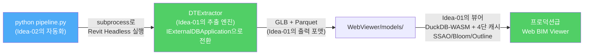

# Idea-01 vs Idea-02

## 1.1. Revit → 웹 시각화 파이프라인 비교

두 접근법은 "Revit 파일을 어떻게 변환하여 웹에 올리는가"라는 동일한 문제를 서로 다른 전략으로 해결한다.

**Idea-01: 수동 실행 + 고품질 추출**

**Idea-02: 자동 실행 + 경량 추출**

## 1.2. 핵심 차이점

| 관점                    | Idea-01                                                     | Idea-02                                                        |
| ----------------------- | ----------------------------------------------------------- | -------------------------------------------------------------- |
| **변환 시작**           | 사용자가 Revit을 열고 버튼을 직접 클릭                      | `python pipeline.py` 한 줄로 Revit 실행부터 종료까지 자동 완결 |
| **형상 포맷**           | GLB (바이너리 단일 파일, SharpGLTF)                         | glTF JSON + .bin (텍스트 + 바이너리 분리, Newtonsoft.Json)     |
| **속성 포맷**           | Parquet (GZIP 압축, 20개 컬럼, DuckDB-WASM 직접 쿼리 가능)  | JSON (`semantic_twin.json`, 벽체 카테고리만, 선형 검색)        |
| **속성 추출 범위**      | 7종 파라미터 전수 추출 (전체 카테고리)                      | 인스턴스 + 타입 파라미터 (벽체 카테고리 한정)                  |
| **웹 속성 조회**        | DuckDB-WASM SQL + 4단 캐시 (L1~L3 100ms 이내)               | JSON 배열 `Array.find()` 선형 검색                             |
| **렌더링 품질**         | SSAO, Bloom, Outline 후처리 + Material/Wireframe/X-Ray 모드 | 기본 PBR + CPU 기반 EdgesGeometry 외곽선                       |
| **플러그인 인터페이스** | `IExternalCommand` (GUI 리본 버튼)                          | `IExternalDBApplication` (Revit 시작 시 자동 실행)             |

### 7.3. 관점별 비교 평가

**모델 렌더링 최적화**

Idea-01이 렌더링 성능과 품질에서 우위를 가진다. GLB 바이너리 포맷은 파싱이 빠르고 파일 크기가 작다. SSAO(Screen Space Ambient Occlusion)로 입체감을 강화하고, Bloom과 Outline 후처리로 시각적 완성도를 높인다. X-Ray 모드는 내부 설비/배관 확인에 필수적이다. Idea-02는 기본 PBR 렌더링과 CPU 기반 외곽선만 제공하여, 객체 수가 늘어나면 프레임 저하가 발생한다.

**자동화 편의성**

Idea-02가 압도적으로 유리하다. `python pipeline.py` 한 줄로 Revit 실행 → 추출 → 종료까지 완전 자동화된다. CI/CD 파이프라인 통합, 배치 처리, 모델 갱신 자동화에 즉시 활용 가능하다. Idea-01은 사용자가 Revit을 열고 버튼을 직접 눌러야 하므로, 운영 환경에서 반복적인 모델 갱신에 병목이 된다.

**데이터 정확도 및 풍부성**

Idea-01이 데이터 품질에서 우위를 가진다. 7종 파라미터 전수 추출로 "내화등급 2시간 이상인 벽체" 같은 분석적 쿼리가 가능하다. Parquet 컬럼 기반 저장으로 DuckDB-WASM이 브라우저에서 SQL을 직접 실행한다. Idea-02는 벽체 카테고리의 기본 속성만 추출하여 분석적 활용이 제한된다.

**대형 모델 확장성**

Idea-01의 4단 캐시(L1 인메모리 → L2 IndexedDB → L3 DuckDB-WASM → L4 서버)는 수만 개 BIM 객체에서도 100ms 이내 응답을 보장한다. Idea-02의 JSON 전체 파싱 + 선형 검색은 객체 수 수천 개를 넘으면 브라우저 성능 저하가 발생한다.

**구현 난이도 및 프로토타이핑 속도**

Idea-02가 유리하다. 최소한의 코드로 작동하는 MVP를 빠르게 구현하여 가능성을 검증했다. 단일 HTML 파일 뷰어, JSON 기반 속성, `config.json` 통합 설정 등 구조가 단순하여 이해와 수정이 쉽다.

### 7.4. 통합 전략: 최적의 엔진을 향한 하이브리드 접근

두 접근법의 강점을 결합하면 **Idea-01의 프로덕션급 데이터 품질**과 **Idea-02의 완전 자동화 역량**을 모두 갖춘 엔진을 구현할 수 있다.

| 영역                      | 채택                               | 근거                                                    |
| ------------------------- | ---------------------------------- | ------------------------------------------------------- |
| **플러그인 인터페이스**   | Idea-02 (`IExternalDBApplication`) | Headless 자동 실행 지원. `IExternalCommand`도 병행 가능 |
| **형상 추출 엔진**        | Idea-01 (DTGeometryExporter)       | 50종+ 머티리얼 스키마, 메쉬 해시, SharpGLTF GLB 출력    |
| **메타데이터 추출**       | Idea-01 (DTMetadataCollector)      | 7종 파라미터 전수 추출, Parquet 출력                    |
| **형상 포맷**             | Idea-01 (GLB)                      | 바이너리로 크기 절감, Draco 압축 적용 가능              |
| **속성 포맷**             | Idea-01 (Parquet)                  | DuckDB-WASM 직접 쿼리, 컬럼 기반 분석                   |
| **자동화 오케스트레이션** | Idea-02 (Python pipeline.py)       | subprocess + config.json 통합 관리                      |
| **보안 팝업 처리**        | Idea-02 (pyautogui)                | 또는 Revit Journal 파일 기반 대안 검토                  |
| **웹 뷰어**               | Idea-01 (DTEngine)                 | DuckDB-WASM, 4단 캐시, SSAO/Bloom/Outline, 렌더링 모드  |
| **설정 관리**             | 하이브리드                         | config.json 통합 + constants.ts 모델별 상세 설정        |

**핵심 통합 포인트:**

1. Idea-01의 `DTExtractor`를 `IExternalCommand`에서 `IExternalDBApplication`으로 전환하면, Idea-02의 Python 자동화 파이프라인에 그대로 편입된다. 이것만으로 두 접근법의 가장 큰 단점이 동시에 해소된다.
2. Idea-02의 `config.json` 통합 설정 패턴을 채택하되, 뷰어 렌더링/모델별 상세 설정은 Idea-01의 `constants.ts`로 분리하여 관심사를 구분한다.
3. `pyautogui` 기반 보안 팝업 처리는 환경 의존성이 높으므로, Revit Journal 파일 또는 `RevitServerTool.exe` 기반 자동화를 병행 검토한다.
