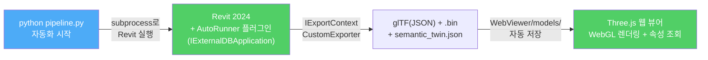
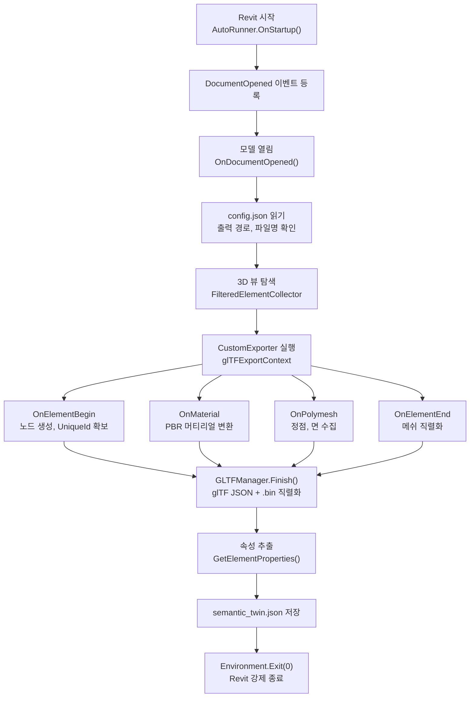
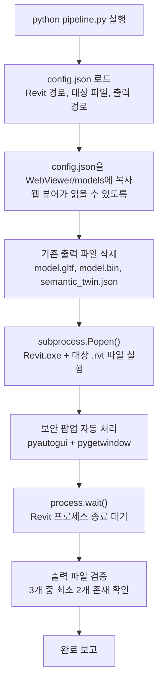
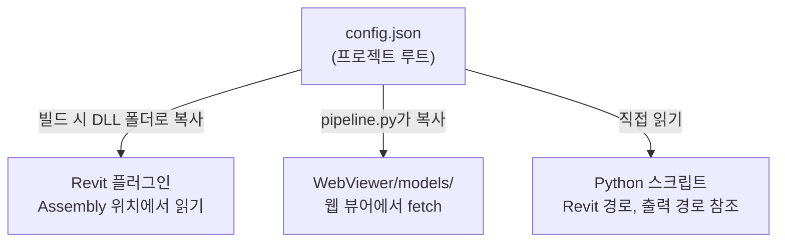
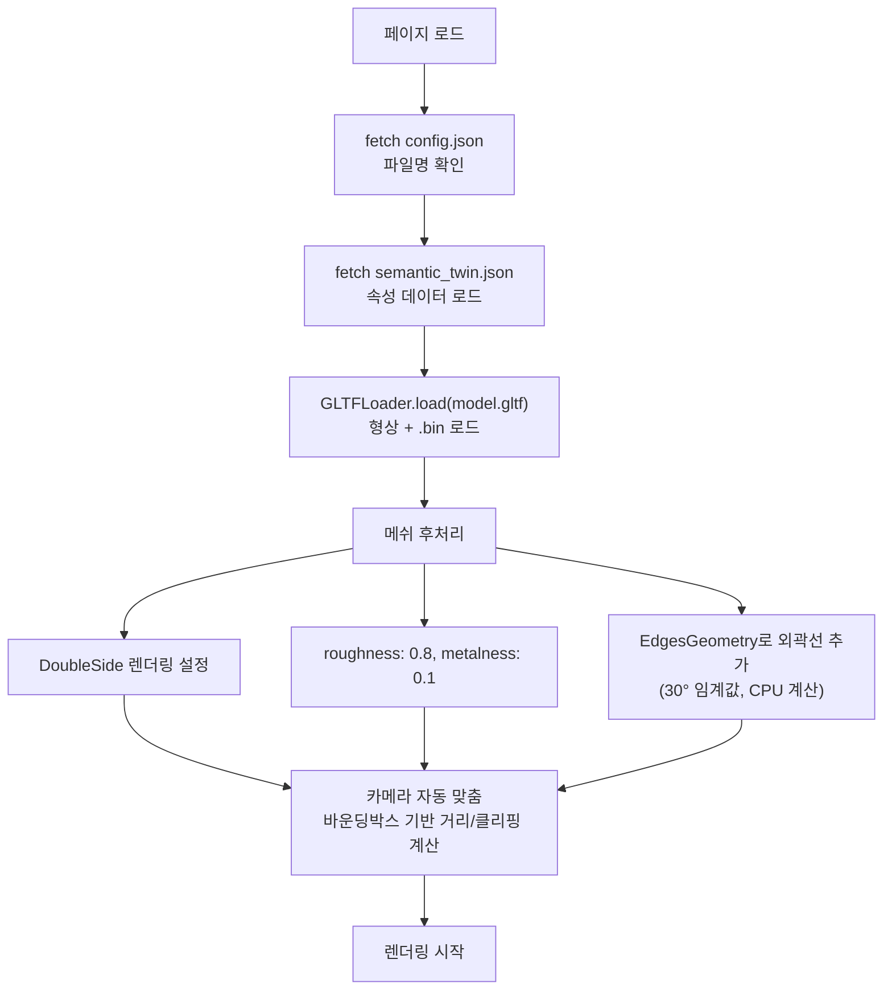
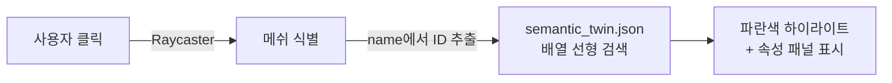

# Idea-02

**상용 솔루션 없이 Revit 모델을 웹에서 시각화하는 자체 제작 Web BIM Viewer — Python 자동화 + Revit C# 플러그인 + Three.js**

> **소스 코드**: https://github.com/yezzero/DTCustomEngine

---

## 목차

1. [전체 요약](#1-전체-요약)
2. [데이터 파이프라인: Revit에서 glTF와 JSON까지](#2-데이터-파이프라인-revit에서-gltf와-json까지)
3. [Python 자동화: Headless 파이프라인](#3-python-자동화-headless-파이프라인)
4. [웹 뷰어: Three.js 기반 시각화](#4-웹-뷰어-threejs-기반-시각화)
5. [평가](#5-평가)
6. [실행 방법](#6-실행-방법)
7. [Idea-01 vs Idea-02: 비교 및 통합 전략](#7-idea-01-vs-idea-02-비교-및-통합-전략)

---

## 1. 전체 요약

이 엔진은 상용 솔루션 없이 Revit 모델(RVT)을 웹에서 시각화하는 **자체 제작 Web BIM Viewer**이다. Python 스크립트 한 번 실행으로 Revit 실행부터 데이터 추출, 웹 뷰어 연동까지 전 과정이 자동으로 완결되는 **End-to-End Headless 자동화 파이프라인**이 핵심이다.

Revit 시작 시 C# 플러그인(`IExternalDBApplication`)이 자동 로드되어 3D 형상을 **glTF 2.0**(JSON + .bin)으로, BIM 속성을 **JSON**(`semantic_twin.json`)으로 분리 추출한다. 추출 완료 후 Revit이 자동 종료되고, Three.js 기반 웹 뷰어가 결과물을 로드하여 브라우저에서 3D 렌더링과 속성 조회를 수행한다.



| 구분               | 기술                                    | 역할                                                       |
| :----------------- | :-------------------------------------- | :--------------------------------------------------------- |
| **Revit 플러그인** | C# .NET 4.8 (`IExternalDBApplication`)  | Revit 시작 시 자동으로 형상/속성 추출, 완료 후 Revit 종료  |
| **자동화**         | Python 3.9+ (`subprocess`, `pyautogui`) | Revit 실행, 보안 팝업 자동 처리, 파이프라인 오케스트레이션 |
| **웹 뷰어**        | Three.js 0.160 (WebGL)                  | glTF 로드, 3D 렌더링, 클릭 기반 속성 조회                  |
| **형상 출력**      | glTF 2.0 (JSON) + .bin                  | 노드 계층·머티리얼·접근자 정의(JSON), 정점·인덱스(bin)     |
| **속성 출력**      | JSON (`semantic_twin.json`)             | 요소별 BIM 파라미터 배열                                   |
| **설정**           | config.json                             | Revit 경로, 대상 파일, 출력 디렉토리 통합 관리             |

---

## 2. 데이터 파이프라인: Revit에서 glTF와 JSON까지

### AutoRunner: Revit 시작 시 자동 실행 플러그인

AutoRunner는 `IExternalDBApplication` 인터페이스를 구현하는 C# 플러그인이다. 일반적인 `IExternalCommand`(사용자가 리본 버튼을 눌러 실행)와 달리, **Revit이 시작될 때 자동으로 로드**되며 `DocumentOpened` 이벤트에 등록하여 모델이 열리는 순간 데이터 추출을 시작한다. 추출이 완료되면 `Environment.Exit(0)`으로 Revit을 강제 종료하여, 사람의 개입 없이 전 과정이 완결된다.

이 설계 덕분에 Python 스크립트가 Revit을 subprocess로 실행하기만 하면, 내부에서 플러그인이 자동으로 동작하고 결과물을 저장한 뒤 프로세스가 종료되는 **Headless 자동화**가 가능하다.

### 추출 과정



### IExportContext 콜백 구조

Revit API의 `CustomExporter` + `IExportContext` 인터페이스를 사용한다. `glTFExportContext`가 이를 구현하며, Revit의 내부 렌더링 파이프라인에서 테셀레이션된 메쉬 데이터를 콜백으로 수신한다.

| 콜백                    | 역할                                                               |
| ----------------------- | ------------------------------------------------------------------ |
| `Start()`               | GLTFManager 초기화                                                 |
| `OnElementBegin()`      | glTF 노드 생성, UniqueId를 Extras에 기록                           |
| `OnMaterial()`          | Revit 머티리얼 → PBR(baseColor, metallic, roughness) 변환          |
| `OnPolymesh()`          | 정점/면 데이터 수집, 좌표계 변환(Z-up → Y-up), 피트 → mm 단위 변환 |
| `OnInstanceBegin/End()` | 패밀리 인스턴스의 트랜스폼 처리                                    |
| `OnLinkBegin/End()`     | 링크된 모델 처리                                                   |
| `Finish()`              | glTF JSON + .bin 파일 직렬화                                       |

### 형상 최적화

GLTFManager는 추출 시점에 다음의 최적화를 수행한다.

- **SHA256 해시 기반 메쉬 중복 제거**: 동일 형상의 정점/인덱스 데이터를 SHA256 해시로 비교하여, 같은 패밀리 타입의 반복 형상을 한 번만 저장한다.
- **버퍼 중복 제거**: 바이너리 데이터 레벨에서도 SHA256 해시 비교를 통해 중복 버퍼를 제거한다.
- **정점 중복 제거**: `VertexLookupInt` 딕셔너리를 사용하여 동일 좌표의 정점을 인덱스로 재사용한다.
- **단일 .bin 파일**: `SingleBinary = true` 설정으로 모든 형상 데이터를 하나의 바이너리 파일로 병합하여 HTTP 요청 수를 최소화한다.

### 좌표계 변환

Revit은 Z-Up 좌표계(피트 단위)를 사용하고, WebGL/Three.js는 Y-Up 좌표계를 사용한다. `FlipCoords = true` 설정에 의해 플러그인이 추출 시점에 다음 변환을 적용한다.

- **좌표**: Revit(X, Y, Z) → Web(X, Z, -Y)
- **단위**: 피트 → 밀리미터 (× 25.4 × 12)
- **트랜스폼**: 4×4 변환 행렬도 동일하게 축 변환 적용

### 속성 추출

`Util.GetElementProperties()` 함수가 각 요소의 파라미터를 순회하여 JSON 배열로 저장한다.

- **인스턴스 파라미터**: `Element.Parameters` 순회
- **타입 파라미터**: `Element.GetTypeId()`로 타입 요소를 가져와 파라미터 순회
- **값 변환**: `StorageType.String`이면 `AsString()`, 그 외는 `AsValueString()`(단위 포함 포맷)
- **출력**: `semantic_twin.json` — 요소별 `{ id, name, length, ... }` 배열

현재 속성 추출 대상은 벽체(`OST_Walls`) 카테고리에 한정되어 있으며, Idea-01이 제안하는 7종 파라미터 전수 추출(인스턴스, 타입, 공유, 프로젝트, 글로벌, BuiltIn, 패밀리)에 비해 범위가 제한적이다.

### 산출물

하나의 Revit 모델에서 세 파일이 생성된다.

| 산출물          | 포맷                        | 역할                                       | GUID 저장 위치         |
| --------------- | --------------------------- | ------------------------------------------ | ---------------------- |
| 형상 파일       | glTF 2.0 (JSON)             | 노드 계층, 머티리얼, 접근자(Accessor) 정의 | 노드 `extras.UniqueId` |
| 바이너리 데이터 | .bin                        | 정점, 인덱스 바이너리                      | —                      |
| 속성 파일       | JSON (`semantic_twin.json`) | 요소별 BIM 파라미터                        | `id` 필드              |

**glTF 노드 구조 예시:**

```
Node {
  name: "Wall <1234 Exterior Wall>",
  mesh: 0,
  matrix: [변환 행렬],
  extras: {
    UniqueId: "xxxxxxxx-xxxx-xxxx-xxxx-xxxxxxxxxxxx",
    Properties: { "Element Category": "Walls", "Height": "3000mm", ... }
  }
}
```

---

## 3. Python 자동화: Headless 파이프라인

### 파이프라인 전체 흐름

Python 스크립트(`pipeline.py`)가 전체 프로세스를 오케스트레이션한다.



### 보안 팝업 자동 처리

Revit 2024는 서명되지 않은 애드인을 로드할 때 보안 경고 팝업을 표시한다. `pipeline.py`는 이를 자동으로 처리한다.

1. `pygetwindow`로 "Security" 또는 "보안" 키워드가 포함된 윈도우를 감지한다.
2. 해당 윈도우를 활성화한다.
3. `pyautogui`로 좌측 화살표를 3회 입력하여 "Always Load" 버튼으로 이동한 뒤 Enter를 누른다.
4. 최대 60초간 2초 간격으로 반복 모니터링한다.

### 중앙 설정 관리

`config.json` 하나로 전체 파이프라인의 설정을 통합 관리한다.



| 키                        | 용도                             |
| ------------------------- | -------------------------------- |
| `revit.exePath`           | Revit 실행 파일 경로             |
| `revit.targetRvtFile`     | 변환 대상 .rvt 파일 경로         |
| `output.dir`              | 출력 디렉토리 (WebViewer/models) |
| `output.gltf`             | glTF 파일명                      |
| `output.gltfBin`          | .bin 파일명                      |
| `output.semanticTwinJson` | 속성 JSON 파일명                 |

---

## 4. 웹 뷰어: Three.js 기반 시각화

### 렌더링 구성

웹 뷰어는 단일 HTML 파일(`index.html`)로 구현되며, Three.js 0.160을 CDN에서 ES 모듈로 로드한다.

| 구성 요소  | 설정                                              |
| ---------- | ------------------------------------------------- |
| **렌더러** | WebGLRenderer (antialias, logarithmicDepthBuffer) |
| **카메라** | PerspectiveCamera (FOV 45, 모델에 자동 맞춤)      |
| **조명**   | AmbientLight(0.6) + DirectionalLight(0.8, 그림자) |
| **컨트롤** | OrbitControls (감쇠 활성)                         |
| **배경**   | #f0f0f0                                           |

### 모델 로딩



### 클릭-속성 연동

사용자가 3D 객체를 클릭하면 해당 요소의 BIM 속성이 표시된다.



1. **레이캐스팅**: `Raycaster.intersectObjects()`로 클릭된 메쉬를 식별한다. BVH 가속 없이 전체 씬 객체를 대상으로 교차 판정한다.
2. **ID 매칭**: 메쉬 또는 부모 노드의 `name`에서 ElementId를 추출한다.
3. **속성 조회**: `semantic_twin.json` 배열에서 `Array.find()`로 매칭되는 `id`를 선형 검색한다.
4. **하이라이트**: 클릭된 메쉬의 머티리얼을 복제하여 파란색(0x00aaff)으로 변경한다.
5. **패널 표시**: 우측 상단 정보 패널에 ID와 속성을 표시한다.

---

## 5. 평가

### 강점

**End-to-End 자동화.** Python 스크립트 한 번 실행으로 Revit 실행 → 데이터 추출 → 웹 뷰어 연동까지 사람의 개입 없이 완결된다. `IExternalDBApplication`을 활용한 Headless 실행과 `pyautogui` 기반 보안 팝업 처리가 핵심이다.

**단순한 아키텍처.** Revit 플러그인(C#) + 자동화(Python) + 뷰어(HTML/JS) 세 개의 독립적인 컴포넌트로 구성되어, 각 부분을 독립적으로 이해하고 수정할 수 있다.

**표준 포맷 채택.** glTF 2.0은 Khronos 국제 표준이며 Three.js가 네이티브로 지원한다. 별도의 포맷 변환 없이 바로 렌더링할 수 있다.

**형상 최적화.** SHA256 해시 기반 메쉬/버퍼 중복 제거와 정점 중복 제거가 구현되어 있어, 반복되는 패밀리 타입의 파일 크기를 절감한다.

**통합 설정 관리.** `config.json` 하나로 플러그인, 스크립트, 웹 뷰어의 설정을 관리하여 배포와 환경 구성이 단순하다.

### 개선 필요

- **속성 추출 범위**: 현재 벽체(`OST_Walls`)만 추출한다. 전체 카테고리로 확장하고, 7종 파라미터(인스턴스, 타입, 공유, 프로젝트, 글로벌, BuiltIn, 패밀리) 전수 추출이 필요하다.
- **속성 조회 확장성**: JSON 배열 전체를 파싱하고 선형 검색하는 방식은 객체 수가 수천 개를 넘으면 브라우저 성능 저하가 발생한다. Parquet + DuckDB-WASM 등 대안이 필요하다.
- **glTF 텍스트 포맷**: glTF(JSON) + .bin 분리 형태로 출력되어, GLB(바이너리 단일 파일) 대비 파일 크기가 크고 HTTP 요청이 2회 필요하다. GLB 전환과 Draco 압축 적용이 필요하다.
- **외곽선 CPU 부하**: `EdgesGeometry`를 CPU에서 계산하여 객체가 많을 때 프레임 저하가 발생한다. GPU 셰이더 기반 외곽선으로의 전환이 필요하다.
- **레이캐스팅 성능**: BVH 가속 구조 없이 전체 씬 객체를 대상으로 교차 판정하여, 대형 모델에서 클릭 응답이 느려진다.
- **렌더링 후처리 부재**: SSAO, Bloom, Outline 등 후처리 효과가 없어 시각적 품질이 기본 수준이다.
- **pyautogui 안정성**: UI 자동화 방식은 해상도, 언어 설정, Revit 버전 등 환경 변수에 민감하다. Revit Journal 파일 기반 자동화 등 대안 검토가 필요하다.

---

## 6. 실행 방법

### 1) 사전 준비

- Revit 2024가 설치된 Windows 환경
- Python 3.9 이상
- Visual Studio 2022 (.NET 4.8)

### 2) Revit 플러그인 빌드 및 설치

1. Visual Studio에서 `RevitAddin/HelloRevit/HelloRevit.csproj`를 연다.
2. `Build Solution`을 실행한다.
3. 빌드된 `HelloRevit.dll`과 `.addin` 매니페스트를 아래 경로에 배치한다.
    - `C:\ProgramData\Autodesk\Revit\Addins\2024\`
4. `config.json`의 경로를 환경에 맞게 수정한다.

### 3) 자동화 파이프라인 실행

```bash
pip install -r requirements.txt
python Automation/pipeline.py
```

스크립트가 Revit을 실행하고, 데이터를 추출하고, Revit을 종료한다. 완료 후 `WebViewer/models/`에 결과 파일이 생성된다.

### 4) 웹 뷰어 실행

`WebViewer/index.html`을 로컬 웹 서버를 통해 브라우저에서 연다.

```bash
cd WebViewer
python -m http.server 8080
# 브라우저에서 http://localhost:8080 접속
```
