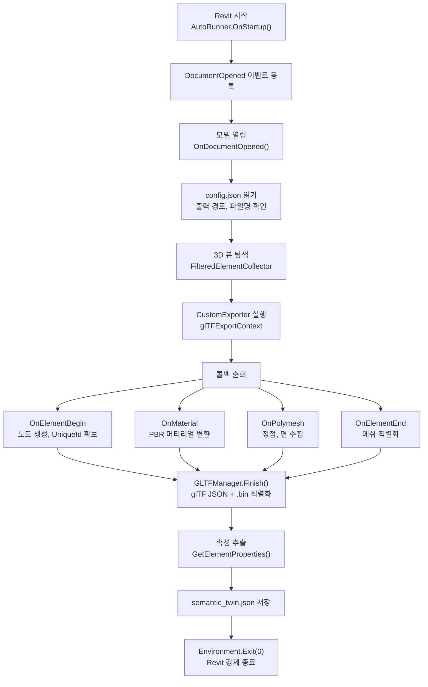
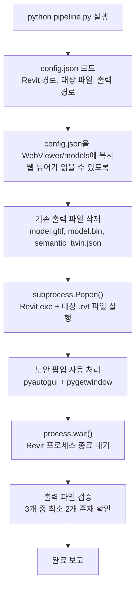
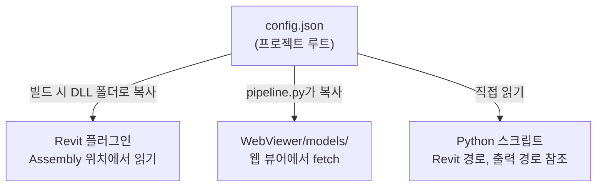
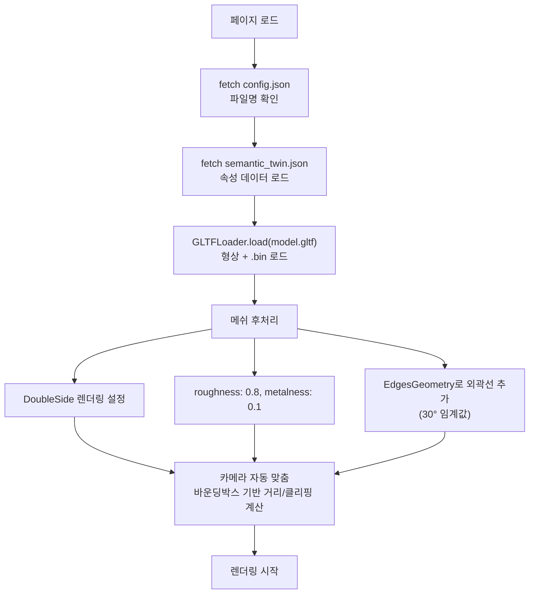
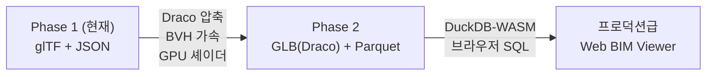
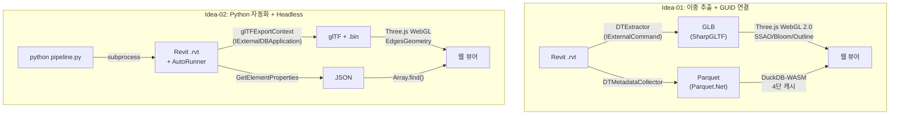
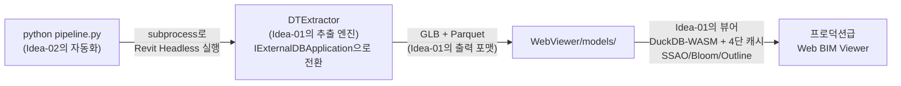

# Idea-02

**자체 제작 Web BIM Viewer: Revit 플러그인 + Python 자동화 + Three.js**

---

## 목차

1. [전체 요약](#1-전체-요약)
2. [데이터 파이프라인: Revit에서 glTF와 JSON까지](#2-데이터-파이프라인-revit에서-gltf와-json까지)
3. [Python 자동화: Headless 파이프라인](#3-python-자동화-headless-파이프라인)
4. [웹 뷰어: Three.js 기반 시각화](#4-웹-뷰어-threejs-기반-시각화)
5. [Phase 2 최적화 계획](#5-phase-2-최적화-계획)
6. [평가](#6-평가)
7. [실행 방법](#7-실행-방법)
8. [Idea-01 vs Idea-02: 상세 비교 및 리뷰](#8-idea-01-vs-idea-02-상세-비교-및-리뷰)

> **소스 코드**: https://github.com/yezzero/DTCustomEngine

---

## 1. 전체 요약

이 엔진은 상용 솔루션 없이 Revit 모델(RVT)을 웹에서 시각화할 수 있는 **자체 제작(In-house) Web BIM Viewer**이다. 핵심은 Python 스크립트 한 번 실행으로 Revit 실행부터 데이터 추출, 웹 뷰어 연동까지 전 과정이 자동으로 완결되는 **End-to-End 자동화 파이프라인**이다.

Revit 내부에서 C# 플러그인(`IExternalDBApplication`)이 자동 실행되어 3D 형상을 **glTF**(JSON + Binary)로, BIM 속성을 **JSON**으로 분리 추출한다. 추출된 파일은 Three.js 기반 웹 뷰어가 로드하여 브라우저에서 3D 렌더링과 속성 조회를 수행한다.


| 구분               | 기술                                    | 역할                                                       |
| :----------------- | :-------------------------------------- | :--------------------------------------------------------- |
| **Revit 플러그인** | C# .NET 4.8 (`IExternalDBApplication`)  | Revit 자동 실행 시 DB 레벨에서 형상/속성 추출              |
| **자동화**         | Python 3.9+ (`subprocess`, `pyautogui`) | Revit 실행, 보안 팝업 자동 처리, 파이프라인 오케스트레이션 |
| **웹 뷰어**        | Three.js 0.160 (WebGL)                  | glTF 로드, 3D 렌더링, 클릭 기반 속성 조회                  |
| **출력 포맷**      | glTF 2.0 (JSON) + .bin + JSON           | 형상(glTF/bin), 속성(semantic_twin.json)                   |
| **설정**           | config.json                             | Revit 경로, 대상 파일, 출력 디렉토리 통합 관리             |

---

## 2. 데이터 파이프라인: Revit에서 glTF와 JSON까지

### Revit 플러그인 AutoRunner

AutoRunner는 `IExternalDBApplication` 인터페이스를 구현하는 C# 플러그인이다. 일반적인 `IExternalCommand`(사용자가 버튼을 눌러 실행)와 달리, **Revit이 시작될 때 자동으로 로드**되며 `DocumentOpened` 이벤트에 등록하여 모델이 열리는 순간 자동으로 데이터 추출을 시작한다. 추출 완료 후 `Environment.Exit(0)`로 Revit을 강제 종료하여, 사람의 개입 없이 전 과정이 완결된다.

이 설계 덕분에 Python 스크립트가 Revit을 subprocess로 실행하기만 하면, 내부에서 플러그인이 자동으로 동작하고 결과물을 저장한 뒤 프로세스가 종료되는 **Headless 자동화**가 가능하다.

### 추출 과정



### IExportContext 콜백 구조

Idea-01과 동일하게 Revit API의 `CustomExporter` + `IExportContext` 인터페이스를 사용한다. `glTFExportContext`가 이를 구현하며, Revit의 내부 렌더링 파이프라인에서 테셀레이션된 메쉬 데이터를 콜백으로 수신한다.

| 콜백                    | 역할                                                               |
| ----------------------- | ------------------------------------------------------------------ |
| `Start()`               | GLTFManager 초기화                                                 |
| `OnElementBegin()`      | glTF 노드 생성, UniqueId를 Extras에 기록                           |
| `OnMaterial()`          | Revit 머티리얼 → PBR(baseColor, metallic, roughness) 변환          |
| `OnPolymesh()`          | 정점/면 데이터 수집, 좌표계 변환(Z-up → Y-up), 피트 → mm 단위 변환 |
| `OnInstanceBegin/End()` | 패밀리 인스턴스의 트랜스폼 처리                                    |
| `OnLinkBegin/End()`     | 링크된 모델 처리                                                   |
| `Finish()`              | glTF JSON + .bin 파일 직렬화                                       |

### 형상 최적화

GLTFManager는 다음의 최적화를 수행한다.

- **SHA256 해시 기반 메쉬 중복 제거**: 동일 형상의 정점/인덱스 데이터를 해시로 비교하여, 같은 패밀리 타입의 반복 형상을 한 번만 저장한다.
- **버퍼 중복 제거**: 바이너리 데이터 레벨에서도 해시 비교를 통해 중복 버퍼를 제거한다.
- **단일 .bin 파일**: 모든 형상 데이터를 하나의 바이너리 파일로 병합하여 HTTP 요청 수를 최소화한다.

### 좌표계 변환

Revit은 Z-Up 좌표계(피트 단위)를 사용하고, WebGL/Three.js는 Y-Up 좌표계(밀리미터 단위)를 사용한다. 플러그인은 추출 시점에 다음 변환을 적용한다.

- **좌표**: Revit(X, Y, Z) → Web(X, Z, -Y)
- **단위**: 피트 → 밀리미터 (× 25.4 × 12)
- **트랜스폼**: 4×4 변환 행렬도 동일하게 축 변환 적용

### 속성 추출

`Util.GetElementProperties()` 함수가 각 요소의 파라미터를 순회하여 JSON 배열로 저장한다.

- **인스턴스 파라미터**: `Element.Parameters` 순회
- **타입 파라미터**: `Element.GetTypeId()`로 타입 요소를 가져와 파라미터 순회
- **값 변환**: `StorageType.String`이면 `AsString()`, 그 외는 `AsValueString()`(단위 포함 포맷)
- **출력**: `semantic_twin.json` — 요소별 `{ id, name, length, ... }` 배열

### 산출물

하나의 Revit 모델에서 세 파일이 생성된다.

| 산출물          | 포맷                        | 역할                                       | GUID 저장 위치         |
| --------------- | --------------------------- | ------------------------------------------ | ---------------------- |
| 형상 파일       | glTF 2.0 (JSON)             | 노드 계층, 머티리얼, 접근자(Accessor) 정의 | 노드 `extras.UniqueId` |
| 바이너리 데이터 | .bin                        | 정점, 인덱스 바이너리                      | —                      |
| 속성 파일       | JSON (`semantic_twin.json`) | 요소별 BIM 파라미터                        | `id` 필드              |

**glTF 노드 구조 예시:**

```
Node {
  name: "Wall <1234 Exterior Wall>",
  mesh: 0,
  matrix: [변환 행렬],
  extras: {
    UniqueId: "xxxxxxxx-xxxx-xxxx-xxxx-xxxxxxxxxxxx",
    Properties: { "Element Category": "Walls", "Height": "3000mm", ... }
  }
}
```

---

## 3. Python 자동화: Headless 파이프라인

### 파이프라인 전체 흐름

Python 스크립트(`pipeline.py`)가 전체 프로세스를 오케스트레이션한다.



### 보안 팝업 자동 처리

Revit 2024는 서명되지 않은 애드인을 로드할 때 보안 경고 팝업을 표시한다. `pipeline.py`는 이를 자동으로 처리한다.

1. `pygetwindow`로 "Security" 또는 "보안" 키워드가 포함된 윈도우를 감지한다.
2. 해당 윈도우를 활성화한다.
3. `pyautogui`로 좌측 화살표를 3회 입력하여 "Always Load" 버튼으로 이동한 뒤 Enter를 누른다.
4. 최대 60초간 2초 간격으로 반복 모니터링한다.

### 중앙 설정 관리

`config.json` 하나로 전체 파이프라인의 설정을 통합 관리한다.



설정 항목:

| 키                        | 용도                             |
| ------------------------- | -------------------------------- |
| `revit.exePath`           | Revit 실행 파일 경로             |
| `revit.targetRvtFile`     | 변환 대상 .rvt 파일 경로         |
| `output.dir`              | 출력 디렉토리 (WebViewer/models) |
| `output.gltf`             | glTF 파일명                      |
| `output.gltfBin`          | .bin 파일명                      |
| `output.semanticTwinJson` | 속성 JSON 파일명                 |

---

## 4. 웹 뷰어: Three.js 기반 시각화

### 렌더링 구성

웹 뷰어는 단일 HTML 파일(`index.html`)로 구현되며, Three.js 0.160을 CDN에서 로드한다.

| 구성 요소  | 설정                                              |
| ---------- | ------------------------------------------------- |
| **렌더러** | WebGLRenderer (antialiasing 활성)                 |
| **카메라** | PerspectiveCamera (FOV 45, 모델에 자동 맞춤)      |
| **조명**   | AmbientLight(0.6) + DirectionalLight(0.8, 그림자) |
| **컨트롤** | OrbitControls (감쇠 활성)                         |
| **배경**   | #f0f0f0                                           |

### 모델 로딩



### 클릭-속성 연동

사용자가 3D 객체를 클릭하면 해당 요소의 BIM 속성이 표시된다.

1. **레이캐스팅**: `Raycaster.intersectObjects()`로 클릭된 메쉬를 식별한다.
2. **ID 매칭**: 메쉬 또는 부모 노드의 `name`에서 ElementId를 추출한다.
3. **속성 조회**: `semantic_twin.json` 배열에서 매칭되는 `id`를 검색한다.
4. **하이라이트**: 클릭된 메쉬의 머티리얼을 복제하여 파란색(0x00aaff)으로 변경한다.
5. **패널 표시**: 우측 상단 정보 패널에 ID와 속성을 표시한다.


---

## 5. Phase 2 최적화 계획

현재 MVP는 소규모 모델에 적합하며, 대형 BIM 데이터를 처리하기 위한 고도화 로드맵이 수립되어 있다.

### 5.1. 형상 경량화: Draco 압축

glTF를 GLB(바이너리)로 병합하고, `gltf-pipeline`의 Draco 압축을 적용하여 파일 용량을 **90~95% 절감**한다.

### 5.2. 렌더링 가속: BVH + GPU 셰이더

- **Three-Mesh-BVH**: 공간 분할 트리(BVH)를 적용하여 레이캐스팅(마우스 충돌 감지) 속도를 물리적으로 가속한다.
- **Post-processing Shader**: CPU 연산(EdgesGeometry) 대신 GPU 셰이더를 사용하여 외곽선(Outline) 렌더링 부하를 제거한다.

### 5.3. 속성 조회 고도화: Parquet + DuckDB

JSON 기반 속성 조회를 Parquet + DuckDB-WASM 아키텍처로 전환하여, 수십만 개 객체에 대한 브라우저 내 SQL 쿼리를 가능하게 한다.



---

## 6. 평가

### 강점

**End-to-End 자동화.** Python 스크립트 한 번 실행으로 Revit 실행 → 데이터 추출 → 웹 뷰어 연동까지 사람의 개입 없이 완결된다. `IExternalDBApplication`을 활용한 Headless 실행과 `pyautogui` 기반 보안 팝업 처리가 핵심이다.

**단순한 아키텍처.** Revit 플러그인(C#) + 자동화(Python) + 뷰어(HTML/JS) 세 개의 독립적인 컴포넌트로 구성되어, 각 부분을 독립적으로 이해하고 수정할 수 있다.

**표준 포맷 채택.** glTF 2.0은 Khronos 국제 표준이며 Three.js가 네이티브로 지원한다. 별도의 포맷 변환 없이 바로 렌더링할 수 있다.

**Revit2glTF 기반.** 오픈소스 Revit2glTF의 검증된 변환 로직을 기반으로 하여, IExportContext 구현의 안정성이 확보되어 있다.

### 개선 필요

- **속성 조회 확장성**: JSON 기반 전체 파싱은 수십만 객체에서 브라우저 멈춤이 발생한다. Parquet + DuckDB-WASM으로의 전환이 필요하다.
- **glTF 텍스트 포맷**: 현재 glTF(JSON)로 출력하여 파일 크기가 크다. GLB(바이너리) + Draco 압축을 적용해야 한다.
- **제한적 속성 추출**: `semantic_twin.json`에 기본적인 속성만 포함한다. 7종 파라미터 전수 추출이 필요하다.
- **외곽선 CPU 부하**: `EdgesGeometry`를 CPU에서 계산하여 객체가 많을 때 프레임 저하가 발생한다. GPU 셰이더 기반 외곽선으로 전환이 필요하다.
- **pyautogui 안정성**: UI 자동화 방식은 해상도, 언어 설정, Revit 버전 등 환경 변수에 민감하다. Revit의 Journal 파일 기반 자동화 등 대안을 검토할 필요가 있다.

---

## 7. 실행 방법

### 1) 사전 준비

- Revit 2024가 설치된 Windows 환경
- Python 3.9 이상
- Visual Studio 2022 (.NET 4.8)

### 2) Revit 플러그인 빌드 및 설치

1. Visual Studio에서 `RevitAddin/HelloRevit/HelloRevit.csproj`를 연다.
2. `Build Solution`을 실행한다.
3. 빌드된 `HelloRevit.dll`과 `.addin` 매니페스트를 아래 경로에 배치한다.
    - `C:\ProgramData\Autodesk\Revit\Addins\2024\`
4. `config.json`의 경로를 환경에 맞게 수정한다.

### 3) 자동화 파이프라인 실행

```bash
pip install -r requirements.txt
python Automation/pipeline.py
```

스크립트가 Revit을 실행하고, 데이터를 추출하고, Revit을 종료한다. 완료 후 `WebViewer/models/`에 결과 파일이 생성된다.

### 4) 웹 뷰어 실행

`WebViewer/index.html`을 로컬 웹 서버를 통해 브라우저에서 연다.

```bash
cd WebViewer
python -m http.server 8080
# 브라우저에서 http://localhost:8080 접속
```

---

## 8. Idea-01 vs Idea-02: 상세 비교 및 리뷰

### 8.1. 항목별 비교

| 비교 항목                     | Idea-01                                                | Idea-02                                            |
| ----------------------------- | ------------------------------------------------------ | -------------------------------------------------- |
| **핵심 목표**                 | Autodesk 종속 제거, 프로덕션급 디지털 트윈 엔진        | 자체 Web BIM Viewer 가능성 검증, MVP 프로토타입    |
| **Revit 플러그인 인터페이스** | `IExternalCommand` (GUI 리본 버튼)                     | `IExternalDBApplication` (Revit 시작 시 자동 실행) |
| **플러그인 언어/프레임워크**  | C# .NET (Revit 2023~2024)                              | C# .NET 4.8 (Revit 2024)                           |
| **형상 출력 포맷**            | GLB (glTF 2.0 Binary, SharpGLTF)                       | glTF (JSON) + .bin (Newtonsoft.Json 직접 직렬화)   |
| **속성 출력 포맷**            | Apache Parquet (GZIP, 20개 컬럼, Parquet.Net)          | JSON (`semantic_twin.json`, 기본 속성만)           |
| **GUID 저장 방식**            | glTF 노드 Extras (`userData.guid`)                     | glTF 노드 Extras (`extras.UniqueId`)               |
| **메타데이터 추출 범위**      | 7종 파라미터 (Instance, Type, BuiltIn, Shared 등)      | Instance + Type 파라미터 (기본 수준)               |
| **자동화**                    | GUI 버튼 + 배치 모드(CLI)                              | Python subprocess + pyautogui Headless 자동화      |
| **보안 팝업 처리**            | 해당 없음 (사용자가 직접 실행)                         | pyautogui로 자동 클릭 처리                         |
| **웹 뷰어 렌더링**            | Three.js WebGL 2.0 (SSAO, Bloom, Outline 후처리)       | Three.js WebGL (기본 렌더링 + EdgesGeometry)       |
| **머티리얼**                  | PBR (50종+ Revit 스키마 매핑, 투명도, 양면)            | PBR (기본 색상 추출, roughness 0.8, metalness 0.1) |
| **렌더링 모드**               | Material / Wireframe / X-Ray 3종                       | 기본 모드만 (외곽선 오버레이)                      |
| **카메라**                    | Perspective / Orthographic 전환, 프리셋 애니메이션     | PerspectiveCamera + OrbitControls                  |
| **속성 조회 엔진**            | DuckDB-WASM (브라우저 SQL, Parquet 직접 쿼리)          | JSON 배열 검색 (fetch → Array.find)                |
| **캐시 시스템**               | 4단 (L1 인메모리 → L2 IndexedDB → L3 DuckDB → L4 서버) | 없음 (매번 JSON 전체 로드)                         |
| **설정 관리**                 | `constants.ts` (모델별 설정)                           | `config.json` (전 컴포넌트 통합)                   |
| **좌표계 변환**               | Revit 내부 단위 원본 보존                              | Z-up → Y-up 변환 + 피트 → mm 변환                  |
| **메쉬 최적화**               | 해시 기반 중복 감지 (정점/면 해시)                     | SHA256 해시 기반 중복 제거 + 버퍼 중복 제거        |
| **파일 크기 (예시)**          | racbasic: GLB 8MB + Parquet 147KB                      | (비교 데이터 없음, glTF 텍스트로 상대적으로 큼)    |
| **서버 의존성**               | 없음 (L1~L3 클라이언트 완결)                           | 없음 (정적 파일 서빙만)                            |
| **Phase 2 로드맵**            | WebGPU, ECS, Core-Plugin, LOD 스트리밍, IoT            | Draco 압축, BVH 레이캐스트, Parquet + DuckDB       |

### 8.2. 아키텍처 비교



### 8.3. 프로젝트 적합성 분석

이 프로젝트의 목표는 **Revit 모델을 웹에서 시각화하고 속성을 조회하는 것**이며, 외부 클라우드 서비스 의존을 최소화하는 것이다. 이 기준에서 두 접근법을 평가한다.

#### Idea-01이 유리한 영역

- **속성 조회 성능**: Parquet + DuckDB-WASM 조합은 수만 개 BIM 객체에서도 100ms 이내 응답이 가능하다. JSON 전체 파싱은 객체 수가 수천 개를 넘으면 브라우저 멈춤이 발생한다. 프로덕션 환경에서는 Parquet 기반이 필수적이다.
- **메타데이터 풍부성**: 7종 파라미터 전수 추출은 디지털 트윈의 핵심 가치(속성 기반 분석, 필터링, 통계)를 지탱한다. 기본 속성만으로는 "내화등급 2시간 이상인 벽체" 같은 분석적 쿼리가 불가능하다.
- **렌더링 품질**: SSAO, Bloom, Outline 후처리와 3종 렌더링 모드는 BIM 뷰어로서의 실용성을 크게 높인다. X-Ray 모드는 내부 배관/설비 확인에 필수적이다.
- **캐시 시스템**: 4단 캐시는 반복 조회 시 성능을 극적으로 개선하며, IndexedDB를 통한 세션 간 영속성은 사용자 경험에 직결된다.
- **GLB 바이너리 포맷**: 텍스트 기반 glTF 대비 파일 크기가 작고 파싱이 빠르다.

#### Idea-02가 유리한 영역

- **End-to-End 자동화**: `python pipeline.py` 한 줄로 전 과정이 완결되는 것은 CI/CD 파이프라인 통합, 배치 처리, 모델 갱신 자동화에 즉시 활용 가능한 실질적 이점이다. Idea-01은 사용자가 Revit을 열고 버튼을 눌러야 한다.
- **IExternalDBApplication 활용**: Revit UI 없이 DB 레벨에서 자동 실행되는 방식은 Headless 배치 처리의 핵심이다. 서버에서 Revit을 자동으로 구동하여 변환하는 시나리오에 적합하다.
- **통합 설정 관리**: `config.json` 하나로 플러그인, 스크립트, 웹 뷰어의 설정을 관리하는 것은 배포와 환경 구성을 단순화한다.
- **빠른 프로토타이핑**: 최소한의 코드로 작동하는 MVP를 구현하여 가능성을 빠르게 검증할 수 있다.

### 8.4. 종합 평가

**프로덕션 적합성 측면에서 Idea-01이 더 적합하다.** 디지털 트윈/BIM 뷰어의 핵심 가치는 "3D 시각화 + 풍부한 속성 조회 + 분석적 질의"이며, Idea-01의 Parquet + DuckDB-WASM + 4단 캐시 아키텍처가 이를 직접적으로 지원한다. GLB 바이너리 포맷, 다양한 렌더링 모드, 풍부한 메타데이터 추출도 프로덕션 요구사항에 부합한다.

**그러나 Idea-02의 자동화 파이프라인은 Idea-01에 없는 핵심 역량이다.** Revit 모델이 갱신될 때마다 사람이 Revit을 열고 버튼을 눌러야 하는 것은 운영 효율 관점에서 큰 병목이다. Idea-02의 `IExternalDBApplication` + Python subprocess 패턴은 이 문제를 직접 해결한다.

### 8.5. 하이브리드 구현 제안

두 접근의 강점을 결합하는 것이 최적의 전략이다.



**구체적 통합 방안:**

| 영역                      | 채택                               | 근거                                                    |
| ------------------------- | ---------------------------------- | ------------------------------------------------------- |
| **플러그인 인터페이스**   | Idea-02 (`IExternalDBApplication`) | Headless 자동 실행 지원. `IExternalCommand`도 병행 가능 |
| **형상 추출 엔진**        | Idea-01 (DTGeometryExporter)       | 50종+ 머티리얼 스키마, 메쉬 해시, SharpGLTF GLB 출력    |
| **메타데이터 추출**       | Idea-01 (DTMetadataCollector)      | 7종 파라미터 전수 추출, Parquet 출력                    |
| **형상 포맷**             | Idea-01 (GLB)                      | 바이너리로 크기 절감, 향후 Draco 압축 적용 가능         |
| **속성 포맷**             | Idea-01 (Parquet)                  | DuckDB-WASM 직접 쿼리, 컬럼 기반 분석                   |
| **자동화 오케스트레이션** | Idea-02 (Python pipeline.py)       | subprocess + config.json 통합 관리                      |
| **보안 팝업 처리**        | Idea-02 (pyautogui)                | 또는 Revit Journal 파일 기반 대안 검토                  |
| **웹 뷰어**               | Idea-01 (DTEngine)                 | DuckDB-WASM, 4단 캐시, SSAO/Bloom/Outline, 렌더링 모드  |
| **설정 관리**             | 하이브리드                         | config.json 통합 + constants.ts 모델별 상세 설정        |

**추가 개선 사항:**

1. **pyautogui 대체**: Revit의 Journal 파일 또는 `RevitServerTool.exe` 기반 자동화를 검토한다. UI 자동화보다 환경 독립적이고 안정적이다.
2. **출력 포맷 단계적 전환**: Phase 1에서 JSON을 병행 출력하되, 속성 조회는 Parquet + DuckDB-WASM으로 전환한다. JSON은 디버깅/확인용으로 유지한다.
3. **Draco 압축**: Idea-02의 Phase 2 계획대로 `gltf-pipeline`을 Python 파이프라인에 통합하여, 추출 직후 자동으로 Draco 압축을 적용한다.
4. **BVH 레이캐스트**: Idea-02에서 제안한 Three-Mesh-BVH를 Idea-01 뷰어에 통합하여, 대형 모델에서의 클릭 성능을 개선한다.
5. **통합 설정**: config.json에 Revit 경로/대상 파일/자동화 설정을, constants.ts에 뷰어 렌더링/모델별 상세 설정을 분리하여 관리한다.

이 하이브리드 접근을 통해, **Idea-01의 프로덕션급 데이터 파이프라인과 렌더링 품질**에 **Idea-02의 완전 자동화 역량**을 결합한 엔진을 구현할 수 있다.
